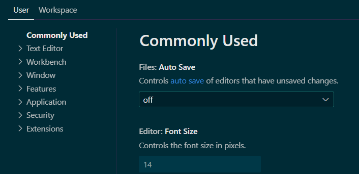

+++
title = 'VSCodeの設定'
subtitle = ""
date = 2024-07-26
lastmod = 2024-07-27
draft = false
KaTex = false
author = "Tuuutti"
authorLink = ""
description = ""
license = "MIT"
images = []
tags = ["VSCode", "設定"]
categories = ["VSCode"]
featuredImage = ""
featuredImagePreview = ""
isCJKLanguage = true
hiddenFromHomePage = false
hiddenFromSearch = false
twemoji = false
lightgallery = true
ruby = true
fraction = true
fontawesome = true
linkToMarkdown = true
rssFullText = false
+++

<!--more-->

## 設定ファイル

[.vscodeリポジトリ](https://github.com/tutti-hobbyist/.vscode)に現時点で使用している `settings.json` と `keybindings.json` を置いているので、良ければ参考にしてください。

### 設定ファイルの優先度
- VSCodeの設定は、**Workspace > User** の順番で優先される (`Ctrl + ,` で各設定を確認可能)
    - Workspace設定
        - ファイルの保存場所は `./vscode/` 配下
        - プロジェクトで共有/推奨したい設定を記載
    - User設定
        - ファイルの保存場所は `%APPDATA%/code/User/` or `%APPDATA%/cursor/User/` 配下
        - ユーザーごとに好みの設定を記載



### 設定ファイルの種類と役割
- settings.json
    - 役割：エディタの外観、動作、拡張機能の設定などをカスタマイズ
    - `%APPDATA%/code/User/` or `%APPDATA%/cursor/User/` 配下に記述することで、User設定を変更可能
        → VSCodeのDefault設定から変更したい項目を指定
    - `./vscode/` 配下にアップすることで、プロジェクト内のみで一時的に適用する設定を指定可能
        → 全プロジェクトで共通の設定をUser設定、プロジェクト単位で使い分けたい設定をWorkspace設定とする
    - 書き方は以下の通り
        ```json
        {
            "editor.fontSize": 14,
            "editor.tabSize": 4,
            "workbench.colorTheme": "Default Dark+",
            "files.autoSave": "onFocusChange"
        }
        ```
- keybindings.json
    - 役割：既存のキーバインディングを変更したり、新しいショートカットを追加
    - `%APPDATA%/code/User/` or `%APPDATA%/cursor/User/` 配下に記述することで、User設定を変更可能
        → VSCodeのDefault設定から変更したい項目を指定
    - `./vscode/` 配下にアップすることで、プロジェクト内のみで一時的に適用する設定を指定可能
        → 全プロジェクトで共通の設定をUser設定、プロジェクト単位で使い分けたい設定をWorkspace設定とする
    - 書き方は以下の通り (配列の中に個々のキーバインディングオブジェクトを記述)
        ```json
        [
            {
                "key": "ctrl+shift+n",
                "command": "workbench.action.files.newUntitledFile"
            },
            {
                "key": "ctrl+b",
                "command": "workbench.action.toggleSidebarVisibility"
            }
        ]
        ```
- extensions.json
    - 役割：プロジェクトに特定の拡張機能を推奨
    - 通常はワークスペース配下でのみ使用
    - 書き方は以下の通り (配列の中に拡張機能のIDを記載)
        ```json
        {
        // Prettier と ESLint を推奨
        "recommendations": [
            "esbenp.prettier-vscode",
            "dbaeumer.vscode-eslint"
            ]
        }
        ```
- launch.json
    - 役割：プロジェクトの実行やデバッグに使用する設定を記述
    - 通常はワークスペース配下でのみ使用
    - 書き方は以下の通り
        ```json
        // node.js の構成定義
        {
        "version": "0.2.0",
        "configurations": [
            {
            "name": "Launch Program",
            "type": "node",
            "request": "launch",
            "program": "${workspaceFolder}/app.js",
            "outFiles": ["${workspaceFolder}/dist/**/*.js"]
            }
            ]
        }
        ```
- devcontainer.json
    - 役割：開発環境をコンテナ内でセットアップするための設定を記述
    - 通常はワークスペース配下でのみ使用
    - 書き方は以下の通り
        ```json
        {
        "name": "Node.js & TypeScript",
        // コンテナのビルド設定
        "build": {
            "dockerfile": "Dockerfile",
            "context": ".."
            },
        "settings": {
            "terminal.integrated.shell.linux": "/bin/bash"
            },
        "extensions": [
            "dbaeumer.vscode-eslint",
            "esbenp.prettier-vscode"
            ],
        // コンテナ作成後のコマンド
        "postCreateCommand": "npm install"
        }
        ```

## 拡張機能の管理方法

### Powershell | スクリプトによる管理
- `code --list-extensions | % { "code --install-extension $_" } >> install_extensions.ps1` を実行し、インストール済みの拡張機能をインストールコマンド付きで列挙
- 生成された install_extensions.ps1 を適宜更新することで、拡張機能を管理し、必要な拡張機能をインストール

### VSC Export & Import | 拡張機能を用いた管理
- `Ctrl + Shift + P` でコマンドパレットを開き、`VSC Extensions` と入力
- `Export` を選択し、vsc-extensions.txt がカレントディレクトリに生成されることを確認
- vsc-extensions.txt を適宜更新することで、拡張機能を管理
- `Ctrl + Shift + P` でコマンドパレットを開き、`VSC Extensions` と入力
- `Import` を選択し、必要な拡張機能をインストール

## 便利な拡張機能

