+++
title = 'Apache Spark徹底入門'
subtitle = ""
date = 2024-11-12
lastmod = 2024-12-07
draft = false
KaTex = false
author = "Tuuutti"
authorLink = ""
description = ""
license = "MIT"
images = []
tags = ["Databricks", "Apache Spark"]
categories = ["Databricks"]
featuredImage = ""
featuredImagePreview = ""
isCJKLanguage = true
hiddenFromHomePage = false
hiddenFromSearch = false
twemoji = false
lightgallery = true
ruby = true
fraction = true
fontawesome = true
linkToMarkdown = true
rssFullText = false
+++
<!--more-->
## 関連リンク
- [Apache Spark徹底入門](https://www.shoeisha.co.jp/book/detail/9784798186788)
- [GitHub](https://github.com/databricks/LearningSparkV2)
- [GitHub日本語](https://github.com/taka-yayoi/SparkSample)

## 動作検証バージョン（2024/11時点）
- Python : 3.11 (3.13では実施していたところ、以下のエラーが発生)
  - エラー解決時に参照：https://stackoverflow.com/questions/77369508/python-worker-keeps-on-crashing-in-pyspark
- JDK : 21.0
- Apache Spark : 3.5

## 1章
### Apache Sparkとは
- 中間計算のためのインメモリストレージを提供
  - 中間結果をすべてメモリに保持しつつ、ディスクI/Oの発生を抑制
- Hadoop Map Reduce よりもはるかに高速な処理が可能
- クエリ計算をDAG（有向非循環グラフ）として構築
### Sparkのコンポーネント

- Driver
  - SparkSessionのインスタンス化
  - ClusterManagerとの通信
  - ClusterManagerへのSparkExecutor（JVM）のリソースのリクエスト
  - SparkプロセスのDAG計算処理への変換
  - 処理のスケジューリング
  - TaskをSparkExecutorに分散
  - リソース割り当て後は、ClusterManagerを介さず直接SparkExecutorと通信
- SparkSession
  - Sparkのすべての機能への統合された単一のエントリーポイント
  - 以前は、SparkContext, SQLContext, StreamingContext などコンテキストを個別に作成する必要があった
- ClusterManager
  - クラスターノードの管理とリソースの割り当て
  - 現在は以下4つのクラスターマネージャーをサポート
    - ビルトインのスタンドアロンクラスターマネージャー
    - Apache Hadoop YARN
    - Apache Mesos
    - Kubernetes
- SparkExecutor
  - ワーカーノード上でタスクを実行
### Deployment Mode
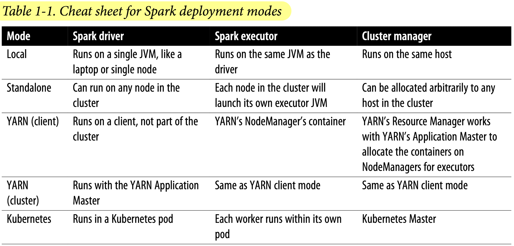

## 2章
### Sparkアプリケーションのコンセプト
- Application
  - SparkのAPIを利用して、Spark上に構築されるユーザープログラム
- SparkSession
  - Sparkの関数と対話するためのオブジェクト
- Job
  - Sparkのアクション（eg: save(), collect()に応じて生成される複数のタスクから構成される並列計算処理
- Stage
  - 各Jobは互いに依存するStageと呼ばれる小さなタスクの集合に分割される
- Task
  - SparkのExecutorに送られる単一の実行単位
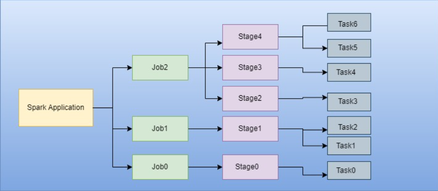
### Sparkの操作
- 分散データに対するSparkの操作は、トランスフォーメーションとアクションの2種類
  - トランスフォーメーション
    - 遅延評価されるため、変換処理は即座に計算されるわけではなく、リネージとして記録
    - リネージの記録を利用して、協調処理や処理の最適化を実現
    - ナロートランスフォーメーション（単一のパーティションで処理が完結）とワイドトランスフォーメーション（複数のパーティションを考慮した処理が必要）の２種類
    - 例：orderBy(), groupBy(), filter(), select(), join()
  - アクション
    - 記録されたトランスフォーメーションの評価を開始するトリガー
    - 例：show(), take(), count(), collect(), save()

## 3章
- コードを動かすために、winutils.exeをbinディレクトリに保存し、PYSPARK_PYTHONを環境変数に追加する必要あり
  - 参照：https://stackoverflow.com/questions/53252181/python-worker-failed-to-connect-back
  - winutils：https://github.com/cdarlint/winutils
### RDDとDSLオペレータ
- RDD
  - ローレベル
  - Sparkは関数内の計算または式を検査できないため、最適化も不可
  ```Python
  data_RDD = sc.parallelize([("A", 20), ("B", 30), ("C", 20), ("A", 30), ("A", 40), ("B", 20)])
  ave_RDD = (data_RDD
    .map(lambda x: (x[0], (x[1], 1)))
    .reduceByKey(lambda x, y: (x[0] + y[0], x[1] + y[1]))
    .map(lambda x: (x[0], x[1][0]/x[1][1]))
  )
  ```
- DSLオペレータ
  - ハイレベル
  - Sparkはクエリを検査または解析して意図を理解できるため、操作の最適化やアレンジが可能
  ```Python
  data_df = spark.createDataFrame([("A", 20), ("B", 30), ("C", 20), ("A", 30), ("A", 40), ("B", 20)], ["group", "value"])
  ave_df = data_df.groupBy("group").agg(avg("value"))
  ```
### データ型
- SparkにおけるPythonの基本的なデータ型
  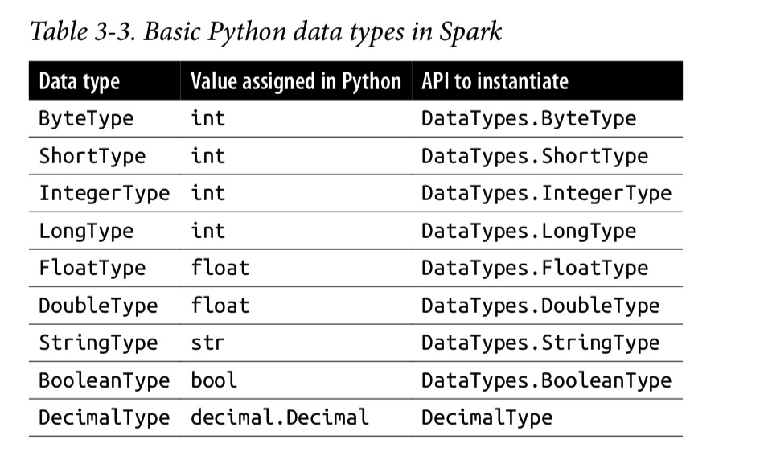
- SparkにおけるPythonの構造化データ型
  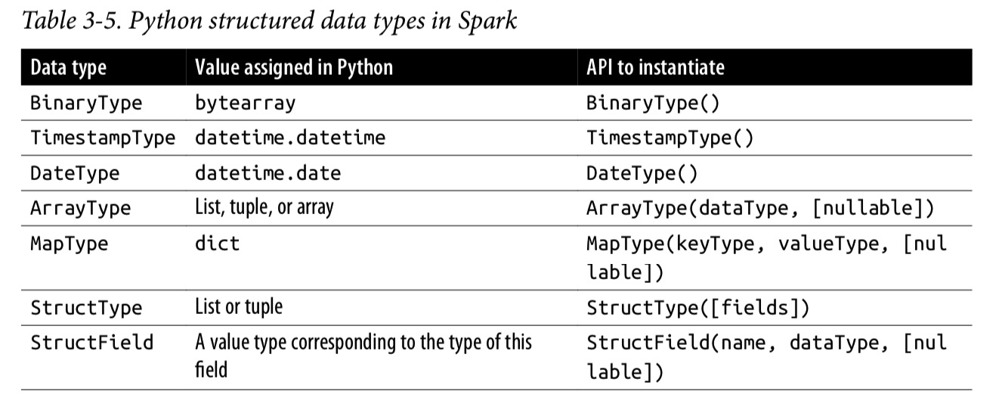
- SparkにおけるScalaの基本的なデータ型
  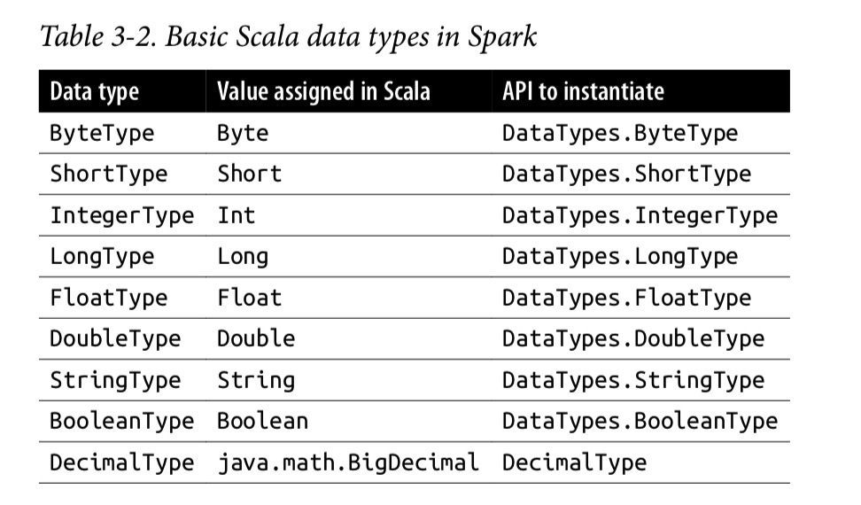
- SparkにおけるScalaの構造化データ型
  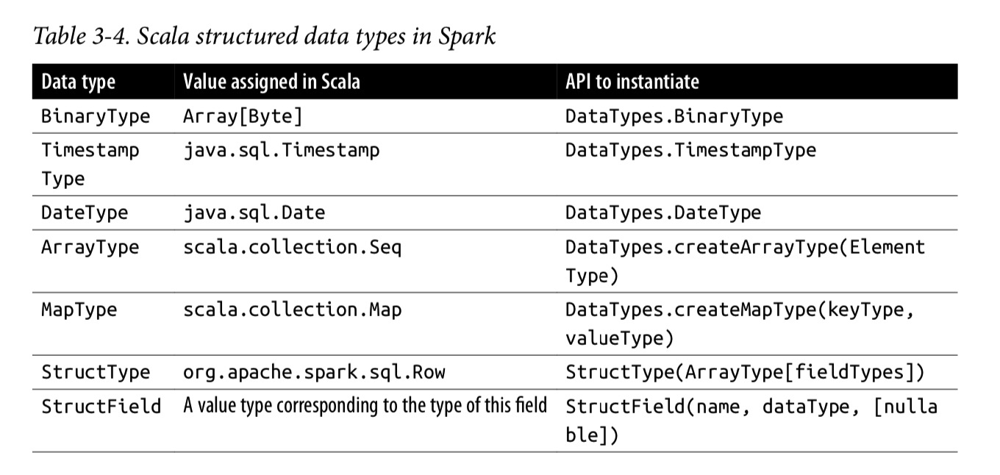
### スキーマの作成
- スキーマは外部データソースからデータを読み取る際に必要
- **事前にスキーマを定義**することは、スキーマ・オン・リード・アプローチよりも以下の利点がある
  - Sparkがデータ型を推論する負担を軽減できる
  - Sparkが別のジョブを作成して、大量のファイルを読み取ってスキーマを確認する必要がなくなる
  - スキーマにデータが一致しない場合、エラーを早期検知できる
- スキーマの定義方法は2つ
  - Sparkのデータ型
  - DDL
  ```Python
  from pyspark.sql import SparkSession

  # 1. Sparkのデータ型
  from pyspark.sql.types import *
  schema = StructType([
      StructField("group", StringType(), nullable=False), 
      StructField("value", IntegerType(), nullable=False)
      ])
  # 2. DDL
  schema = "group STRING, value INT"

  spark = SparkSession.builder.getOrCreate()
  # データを定義して読み込む
  data = [("A", 20), ("B", 30), ("C", 20), ("A", 30), ("A", 40), ("B", 20)]
  data_df = spark.createDataFrame(data, schema)
  # jsonファイルからデータを読み込む
  # json_path = ~~~
  # data_df = spark.read.schema(schema).option("multiline", "true").option("charset", "UTF-8").json("{json_path}")
  
  data_df.show()
  print(data_df.schema) # スキーマ定義の表示
  print(data_df.printSchema()) #スキーマ定義の見やすい表示
  ```
### DataFrameの操作
> - 参照
>   - [pyspark.sql.DataFrameの公式ドキュメント](https://spark.apache.org/docs/latest/api/python/reference/pyspark.sql/api/pyspark.sql.DataFrame.html)
>   - [Pyspark Vs Pandas Cheatsheet](https://www.scribd.com/document/423024301/pyspark-vs-pandas-cheatsheet)
> - DataFrameは実際にはScalaのDataset[Row]
> - 頻繁または繰り返しクエリを実行する予定の大規模なDataFrameの場合、Cacheを利用するとよい
>    - DataFrame.cache()
- 列名の取得  
  ```python
  DataFrame.columns
  ```
- 列名の変更
  ```python
  renamed_DataFrame = DataFrame.withColumnRenamed("{col_name_before}", "{col_name_after}")
  ```
- 列に対する計算
  ```python
  from pyspark.sql.functions import col
  new_DataFrame = DataFrame.select(col("{column_name}")*2)
  ```
- 列に対する計算を元のデータフレームの新規列として定義
  ```python
  from pyspark.sql.functions import expr
  new_col_DataFrame = DataFrame.withColumn("{new_column_name}", (expr("{column_name} {condition}"))) # expr()内部はSQLも記述可能
  ```
- 列に対するソート
  ```python
  from pyspark.sql.functions import col
  sorted_DataFrame = DataFrame.sort(col("{column_name}").desc())
  ```
- 行の作成と要素の取り出し
  ```python
  from pyspark.sql import Row
  one_row = Row("A", 10)
  group, value = one_row[0], one_row[1]
  print(group, value)
  for el in one_row:
    print(el)
  ```
- ある列のユニークな行要素の抽出
  ```python
  (DataFrame
    .select("{column_name}")
    .where(col("{column_name}").isNotNull())
    .distinct()
    .show())
  ```
- 列の削除
  ```python
  DataFrame.drop("{column_name}")
  ```
- 行を用いたDataFrameの作成
  ```python
  from pyspark.sql import Row
  one_row = Row("A", 10)
  another_row = Row("B", 20)
  rows = [one_row, another_row]
  df = spark.createDataFrame(rows, ["group", "value"])
  df.show()
  ```
- データの読み込み
  - sf_fire_calls.csv で確認
  - スキーマの有無による読み込み速度の違い
    - スキーマ指定あり：0.03秒
    - スキーマ指定なし：2.3秒
  ```python
  import os
  import time
  from pyspark.sql import SparkSession
  from pyspark.sql.types import *

  spark = SparkSession.builder.getOrCreate()
  par_dir = os.path.dirname(os.path.abspath(__file__))

  # 1. schemaを指定しない場合
  start = time.time()
  fire_df_without_schema = spark.read.csv(f"{par_dir}/data/sf-fire-calls.csv", header=True) # csvから読み込む場合
  # fire_df_without_schema = spark.read.format("parquet").load(f"{par_dir}/data/sf-fire-calls_parquet") # parquetから読み込む場合
  elapse = time.time() - start
  print(elapse)

  # 2. schemaを指定する場合
  fire_schema = StructType([StructField('CallNumber', IntegerType(), True),
                       StructField('UnitID', StringType(), True),
                       StructField('IncidentNumber', IntegerType(), True),
                       StructField('CallType', StringType(), True),                  
                       StructField('CallDate', StringType(), True),      
                       StructField('WatchDate', StringType(), True),
                       StructField('CallFinalDisposition', StringType(), True),
                       StructField('AvailableDtTm', StringType(), True),
                       StructField('Address', StringType(), True),       
                       StructField('City', StringType(), True),       
                       StructField('Zipcode', IntegerType(), True),       
                       StructField('Battalion', StringType(), True),                 
                       StructField('StationArea', StringType(), True),       
                       StructField('Box', StringType(), True),       
                       StructField('OriginalPriority', StringType(), True),       
                       StructField('Priority', StringType(), True),       
                       StructField('FinalPriority', IntegerType(), True),       
                       StructField('ALSUnit', BooleanType(), True),       
                       StructField('CallTypeGroup', StringType(), True),
                       StructField('NumAlarms', IntegerType(), True),
                       StructField('UnitType', StringType(), True),
                       StructField('UnitSequenceInCallDispatch', IntegerType(), True),
                       StructField('FirePreventionDistrict', StringType(), True),
                       StructField('SupervisorDistrict', StringType(), True),
                       StructField('Neighborhood', StringType(), True),
                       StructField('Location', StringType(), True),
                       StructField('RowID', StringType(), True),
                       StructField('Delay', FloatType(), True)])
  start = time.time()
  fire_df_without_schema = spark.read.csv(f"{par_dir}/data/sf-fire-calls.csv", header=True, schema=fire_schema)
  elapse = time.time() - start
  print(elapse)
  ```
- データの書き込み
  > DataFrameをParquetとして書き込む場合、スキーマはParquetメタデータの一部として保存されるため、以降の読み取りでスキーマを指定する必要がなくなる
  ```python
  fire_df_with_schema.write.format("parquet").mode("overwrite").save(f"{parquet_save_path}")
  # fire_df_with_schema.write.format("parquet").saveAsTable(f"{table_name}") # DataFrameをテーブルとして保存する場合
  ```
- 文字列から日付への変換
  ```python
  new_df = df
            .withColumn("{datetime_col_name}", to_timestamp(col("{str_datetime_col_name}"), "MM/dd/yyyy hh:mm:ss a"))
            .drop("{str_datetime_col_name}")
  ```
- 統計値の確認
  > Pysparkの関数がPythonの組み込み関数と競合しないように、PysparkのモジュールをFとしてインポート
  ```python
  import pyspark.sql.functions as F
  df.select(F.sum("{col_1}"), F.avg("{col_2}"), F.min("{col_3}"), F.max("{col_4}")).show()
  ```
  - 上記以外の統計値を確認するための関数の例
    - stat()
    - describe()
    - correlation()
    - covariance()
    - sampleBy()
    - approxQuantile()
    - frequentItems()
- グループ化
  > agg()（集約関数）を使うと、集約後の列名にエイリアスを指定できるので、列名を自分で定義したいときは便利
  ```python
  # 1. count() + orderBy()
  DataFrame.select("{column_name}").where(col("{column_name}").isNotNull()).groupBy("{column_name}").count().orderBy("count", ascending=False).show()
  # 2. agg() + sort()
  DataFrame.select("{column_name}").where(col("{column_name}").isNotNull()).groupBy("{column_name}").agg(count("{column_name}").alias("{new_column_name}")).sort(col("{new_column_name}").desc()).show()
  ```
- 行方向に結合 (Union)
  ```python
  new_DF = DataFrame.union(another_DataFrame)
  ```
- 列方向に結合 (Join)
  ```python
  new_DF = DataFrame.join(another_DataFrame, DataFrame.{column_name}=another_DataFrame.{column_name})
  ```
- PandasとPySparkの対応
  | **機能**           | **Pandas**      | **PySpark**      |
  |----------------|--------------|-------------------------|
  | **ライブラリのインポートと設定** | `import pandas as pd`<br>`pd.options.display.max_colwidth = 1000` | `from pyspark.sql.types import *`<br>`from pyspark.sql.functions import *`<br>`from pyspark.sql import SQLContext` |
  | **データセットの作成**    | `data = {'col1': [ ], 'col2': [ ]}`<br>`df = pd.DataFrame(data, columns=['col1', 'col2'])` | `StructField('Col1', IntegerType())`<br>`StructField('Col2', StringType())`<br>`schema = StructType([list of StructFields])`<br>`df = SQLContext(sc).createDataFrame(sc.emptyRDD(), schema)` |
  | **CSVの読み込みと書き込み**   | `df.read_csv()`<br>`df.to_csv()`   | `SQLContext(sc).read.csv()`<br>`df.toPandas().to_csv()`    |
  | **インデックスと分割**    | `df.loc[]`<br>`df.iloc[]`     | `df.randomSplit(weights=[ ], seed=n)`     |
  | **データの確認**   | `df.head()`<br>`df.columns`<br>`df.shape`    | `df.show()`<br>`df.head(n)`<br>`df.printSchema()`<br>`df.columns`<br>`df.count()` |
  | **重複データの処理**      | `df.unique()`<br>`df.duplicated()`<br>`df.drop_duplicates()` | `df.distinct().count()`<br>`df.dropDuplicates()`   |
  | **列名の変更**  | `df.rename(columns={"oldcol":"new-col"})`      | `df.withColumnRenamed("oldcol","new-col")`    |
  | **欠損データの処理**      | `df.dropna()`<br>`df.fillna()`<br>`df.replace()`<br>`df['col'].isna()`<br>`df['col'].isnull()`<br>`df['col'].notna()`<br>`df['col'].notnull()` | `df.na.drop()`<br>`df.na.fill()`<br>`df.na.replace()`<br>`df.col.isNull()`<br>`df.col.isNotNull()` |
  | **一般的な列の操作**      | `df['col'] = df['col'].str.lower()`<br>`df['col'] = df['col'].str.replace()`<br>`df['col'] = df['col'].str.split()`<br>`df['col'] = df['col'].str.join()`<br>`df['col'] = df['col'].str.strip()` | `df = df.withColumn('col', lower(df.col))`<br>`df = df.select('*',regexp_replace().alias())`<br>`df = df.withColumn('col', split('col'))`<br>`df = df.withColumn('col', udf.join(df.col, lit(' ')))`<br>`df = df.withColumn('col', trim(df.col))` |
  | **ユーザー定義関数の適用**   | `df['col'] = df['col'].map(UDF)`<br>`df.apply(f)`<br>`df.applyMap(f)` | `df = df.withColumn('col', UDF(df.col))`<br>`df = df.withColumn('col', when(cond, UDF(df.col)).otherwise())` |
  | **2つの列の結合**       | `df['new_col'] = df['col1'] + df['col2']`   | `df = df.withColumn('new_col', concat_ws(',',df.col1,df.col2))`<br>`df.select('*',concat(df.col1,df.col2).alias('new_col'))` |
  | **列をリストに変換**     | `list(df['col'])`    | `df.select("col").rdd.flatMap(lambda x:x).collect()`      |
  | **データのフィルタリング**   | `df = df[df['col'] != ""]`       | `df = df[df['col'] == val]`<br>`df = df.filter(df['col'] == val)`   |
  | **列の選択**       | `df = df[['col1','col2','col3']]`      | `df = df.select('col1','col2','col3')`  |
  | **列の削除**       | `df.drop(['B','C'], axis=1)`<br>`df.drop(columns=['B', 'C'])` | `df.drop('col1','col2')`    |
  | **データのグループ化**   | `df.groupby(by=['col1','col2']).count()`     | `df.groupBy('col').count().show()`      |
  | **データの結合**   | `pd.concat([df1,df2])`<br>`df1.append(df2)`<br>`df1.join(df2)` | `df1.union(df2)`<br>`df1.join(df2)`     |
  | **直積**    | `df1['key'] = 1`<br>`df2['key'] = 1`<br>`df1.merge(df2, how='outer', on='key')` | `df1.crossJoin(df2)`  |
  | **データのソート**       | `df.sort_values()`<br>`df.sort_index()`      | `df.sort()`<br>`df.orderBy()`     |
### SparkSQL
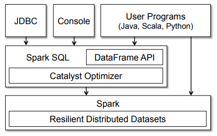
- SparkSQLのCatalystOptimizerは、計算クエリを受け取り、実行計画に変換する
  ```python
  # 実行計画の確認
  DataFrame.explain(True)
  ```
- クエリ最適化の4つのフェーズ
  - 分析：SQLまたはDataFrameクエリの抽象構文木（AST）を生成
  - 論理的最適化：コストベース最適化
  - 物理的最適化：論理計画に適した物理計画を生成
  - コード生成：効率的なJavaバイトコードを生成

## 4章
### TempViewの作成とクエリの実行
> - カラム名にスペースを含む場合、SQLで列名を指定する際に`（バッククォート）で囲む
> - Global Temporary Viewにクエリする際は、`global_temp.{view_name}` で参照
```python
import os
from pyspark.sql import SparkSession
from pyspark.sql.types import *
from pyspark.sql.functions import *

spark = SparkSession.builder.getOrCreate()
par_dir = os.path.dirname(os.path.abspath(__file__))
filename = "Electric_Vehicle_Population_Data.csv" # https://catalog.data.gov/dataset/electric-vehicle-population-data
data_path = f"{par_dir}/data/{filename}"

df = spark.read.format("csv").option("infer_schema", "true").option("header", "true").load(data_path)
df.show(5, False)
print(df.columns)

# TempViewの作成
view_name = "ev_data_temp_view"
df.createOrReplaceTempView(f"{view_name}")

# TempViewに対するクエリ
df_sql = spark.sql(f"SELECT County, State, Model Year, Make, Model, `Electric Vehicle Type`, `Vehicle Location` FROM {view_name}")
df_sql.show(5, False)

# 一致していることを確認
df = df.select('County', 'State', 'Model Year', 'Make', 'Model', 'Electric Vehicle Type', 'Vehicle Location')
df.show(5, False)
```
### メタデータの確認
- Sparkはマネージドテーブル、アンマネージドテーブルに関連するメタデータを管理
- メタデータはCatalogにキャプチャされる
```python
print(spark.catalog.listTables())
print(spark.catalog.listColumns(f"{table_name/view_name}"))
```
### 画像データの読み込み
```python
import os
import cv2
import numpy as np
from PIL import Image
from pyspark.sql import SparkSession
from pyspark.sql.types import *
from pyspark.sql.functions import *

spark = SparkSession.builder.getOrCreate()
par_dir = os.path.dirname(os.path.abspath(__file__))
data_path = f"{par_dir}/images/*"

df_image = spark.read.format("image").load(data_path)
df_binary =  spark.read.format("binaryFile").option("recursiveFileLookup", "false").option("pathGlobFilter", "*.jpg").load(data_path)
print(f"{df_image.printSchema()=}, {df_binary.printSchema()=}")

def show_image(image_row):
    # Sparkの構造から画像データを抽出
    image_data = image_row["image"].asDict()
    height = image_data["height"]
    width = image_data["width"]
    nChannels = image_data["nChannels"]
    data = image_data["data"]

    # データをnumpy配列に変換
    np_image = np.array(data).reshape((height, width, nChannels))

    # 1. cv2で表示
    cv2.imshow("Loaded Image", np_image)
    cv2.waitKey(0)
    cv2.destroyAllWindows()

    # 2. PILで表示
    # pil_image = Image.fromarray(np_image)
    # pil_image.show()

# バイナリデータを扱うためのshow_image関数
def show_binary(image_row):
    # 画像のバイナリデータを取得
    binary_data = image_row["content"]

    # バイナリデータをnumpy配列として読み込む
    image = Image.open(io.BytesIO(binary_data))
    np_image = np.array(image)

    # 1. cv2で表示
    cv2.imshow("Loaded Image", np_image)
    cv2.waitKey(0)
    cv2.destroyAllWindows()

    # 2. PILで表示
    # image.show()

image_row = df_image.select("image").limit(df_image.count()).collect()
for image in image_row:
    show_image(image)

binary_row = df_binary.select("content").limit(df_binary.count()).collect()
for content in binary_row:
    show_binary(content)
```

## 5章
### ユーザー定義関数 (UDF)
- UDFはセッションごとに動作し、メタストアに永続化されない
```python
from pyspark.sql import SparkSession
from pyspark.sql.types import *
from pyspark.sql.functions import *

def cubed(n):
    return n**3

spark = SparkSession.builder.getOrCreate()
spark.udf.register("cubed", cubed, LongType()) # UDFの登録
spark.range(1, 5).createOrReplaceTempView("udf_test") # TempViewの作成
spark.sql("SELECT id, cubed(id) AS id_cubed FROM udf_test").show() # TempViewにUDFを用いたクエリを投げる
```
### Pandas UDFによるPySpark UDFの高速化と分散化
- PySpark UDFはJVMとPython間でのデータ移動が必要であり高コスト
- Pandas UDFはApache Arrowを使用し、データのシリアライズを不要にすることで高速化を実現
```python
import time
from pyspark.sql import SparkSession
from pyspark.sql.types import *
from pyspark.sql.functions import *

spark = SparkSession.builder.getOrCreate()
df = spark.range(1, 10001)

# 純粋なPySpark UDF
def squared(n):
    return n**2

spark.udf.register("squared", squared, LongType()) # UDFの登録

pyspark_udf_elapse_list = []
for iter in range(6):
    pyspark_udf_start = time.time()
    for _ in range(100):
        df.select("id", squared(col("id")))
    pyspark_udf_elapse = time.time() - pyspark_udf_start
    pyspark_udf_elapse_list.append(pyspark_udf_elapse)
print(f"{pyspark_udf_elapse_list = }", np.mean(pyspark_udf_elapse_list))
"""
5回平均処理時間：0.3707027832667033
"""

# Pandas UDFを用いたPySpark UDF
def squared_pd(n:pd.Series) -> pd.Series:
    return n**2

squared_pandas = pandas_udf(squared_pd, returnType=LongType()) # Pandas UDFを定義

pandas_udf_elapse_list = []
for iter in range(6):
    pandas_udf_start = time.time()
    for _ in range(100):
        df.select("id", squared_pandas(col("id")))
    pandas_udf_elapse = time.time() - pandas_udf_start
    pandas_udf_elapse_list.append(pandas_udf_elapse)
print(f"{pandas_udf_elapse_list = }", np.mean(pandas_udf_elapse_list))
"""
5回平均処理時間：0.30323171615600586
"""
```
### ネスト構造のデータ処理
- 複雑なデータ型をそうさするためには、2つの解決策がある
  - ネスト構造を個々の行に展開して、処理を実装（ExplodeとCollect）
    - explode：ネスト構造を個々の行に展開
      ```python
      from pyspark.sql import SparkSession
      from pyspark.sql.types import *

      # 配列型データセットの作成
      arrayData = [[1, (1, 2, 3)], [2, (2, 3, 4)], [3, (3, 4, 5)]]

      spark = SparkSession.builder.getOrCreate()
      # スキーマの作成
      arraySchema = (StructType([
            StructField("id", IntegerType(), True), 
            StructField("values", ArrayType(IntegerType()), True)
            ]))

      # データフレームの作成
      df = spark.createDataFrame(spark.sparkContext.parallelize(arrayData), arraySchema)
      df.createOrReplaceTempView("tmp_vw")
      df.printSchema()
      df.show()

      spark.sql("""
      SELECT id, explode(values) as values FROM tmp_vw
      """).show()

      """
      +---+------+
      | id|values|
      +---+------+
      |  1|     1|
      |  1|     2|
      |  1|     3|
      |  2|     2|
      |  2|     3|
      |  2|     4|
      |  3|     3|
      |  3|     4|
      |  3|     5|
      +---+------+
      """
      ```
    - collect：各グループ内の要素を集計
      ```python
      spark.sql("""
      SELECT id, collect_list(value + 1) AS newValues
        FROM (SELECT id, explode(values) AS value FROM tmp_vw)
        GROUP BY id
      """).show()

      """
      +---+---------+
      | id|newValues|
      +---+---------+
      |  1|[2, 3, 4]|
      |  2|[3, 4, 5]|
      |  3|[4, 5, 6]|
      +---+---------+
      """
      ```
  - UDF：各要素に対して、任意の関数を適用
    ```
    def addOne(values):
      return [value + 1 for value in values]

    spark.udf.register("plusOne", addOne, ArrayType(IntegerType()))  
    spark.sql("SELECT id, plusOne(values) AS newValues FROM tmp_vw").show()
    ```

### データ操作の一覧
- [配列型関数](https://docs.databricks.com/en/sql/language-manual/sql-ref-functions-builtin.html#array-functions)
- [マップ型関数](https://docs.databricks.com/en/sql/language-manual/sql-ref-functions-builtin.html#map-functions)
- [配列型関数とマップ関数のサンプルノートブック](https://docs.databricks.com/ja/semi-structured/higher-order-functions.html#apache-spark-built-in-functions-notebook)
- [組み込み関数一覧](https://docs.databricks.com/en/sql/language-manual/sql-ref-functions-builtin.html#built-in-functions)

### 高階関数
- 使用データ
```python
from pyspark.sql.types import *
schema = StructType([StructField("celsius", ArrayType(IntegerType()))])

t_list = [[35, 36, 32, 30, 40, 42, 38]], [[31, 32, 34, 55, 56]]
t_c = spark.createDataFrame(t_list, schema)
t_c.createOrReplaceTempView("tC")
t_c.show()

"""
+--------------------+
|             celsius|
+--------------------+
|[35, 36, 32, 30, ...|
|[31, 32, 34, 55, 56]|
+--------------------+
"""
```
- Transform：入力配列の各要素に関数を適用して配列を生成
  ```python
  spark.sql("SELECT celsius, transform(celsius, t -> ((t * 9) div 5) + 32) as fahrenheit FROM tC").show()
  ```
- Filter：条件に合致する配列を生成
  ```python
  spark.sql("SELECT celsius, filter(celsius, t -> t > 38) as high FROM tC").show()
  ```
- Exists：指定した値の有無のブール値を生成
  ```python
  spark.sql("SELECT celsius, exists(celsius, t -> t = 38) as threshold FROM tC
  ").show()
  ```
- Reduce (Aggregate)：指定した初期値に対して、配列の要素をアキュムレータに逐次結合（累算）していき、配列の要素を一つずつ減らしていき、最後に得られた単一の値に対する最終関数を適用して結果を返す
  ```python
  spark.sql("""SELECT celsius, 
    reduce(
      celsius,        # 入力配列
      0,              # 初期値
      (acc, t) -> acc + t,        # 逐次更新の方法
      acc -> (acc div size(celsius) * 9 div 5) + 32     # 最終関数
    ) as avgFahrenheit 
    FROM tC
  """).show()
  ```
  ```python
  # 別の書き方
  spark.sql("""SELECT celsius, 
    reduce(
      celsius, 
      named_struct('sum', 0, 'cnt', 0), 
      (acc, t) -> named_struct('sum', acc.sum + t, 'cnt', acc.cnt + 1), 
      acc -> (acc.sum div acc.cnt * 9 div 5) + 32
    ) as avgFahrenheit 
    FROM tC
  """).show()
  ```

## 6章
### Datasetエンコーダ
- エンコーダはSpark内部のTungstenフォーマットからJVM Javaオブジェクトに変換（シリアライズ・デシリアライズ）
### Dataset利用時のコスト
- Datasetが高階関数に渡される場合、Spark内部のTungstenフォーマットからJVMオブジェクトにデシリアライズするためのコストが発生
- コスト削減のための戦略
  1. DSL式をクエリに使用し、高階関数の引数としてラムダを過剰に使用しない
  2. シリアライズとデシリアライズを最小限に抑えるためにクエリを連鎖させる
  ```Scala
  import java.util.Calendar
  val earliestYear = Calendar.getInstance.get(Calendar.YEAR) - 40

  Person(
    id: Integer, 
    firstName: String, 
    middleName: String, 
    lastName: String, 
    gender: String, 
    birthDate: String, 
    ssn: String, 
    salary: String
    )

  // シリアライズとデシリアライズが発生する場合 (効率悪い)
  personDS
  .filter(x => x.birthDate.split("-")(0).toInt > earliestYear) // Lambda
  .filter($"salary" > 80000) // DSL
  .filter(x => x.lastName.startsWith("J")) //Lambda
  .filter($"firstName".startsWith("D")) // DSL
  .count()
  ```
  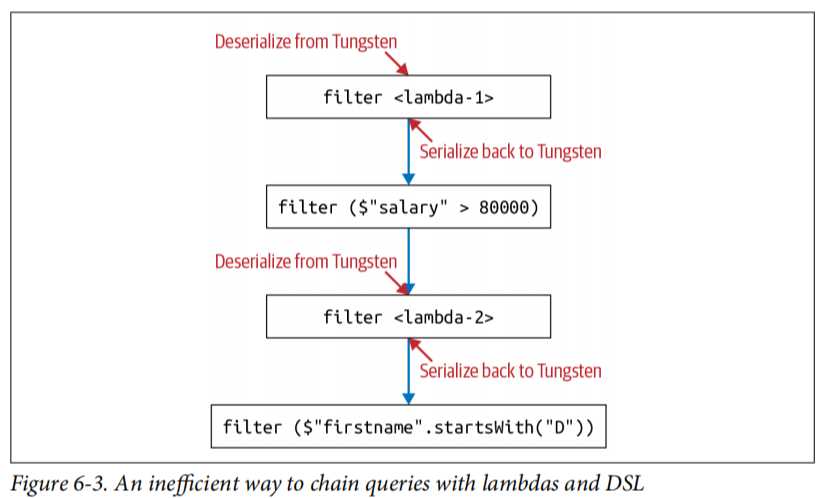
  ```Scala
  // DSLのみの場合 (効率良い)
  personDS
  .filter(year($"birthDate") > earliestYear) // Everyone above 40 
  .filter($"salary" > 80000) // Everyone earning more than 80K
  .filter($"lastName".startsWith("J")) // Last name starts with J
  .filter($"firstName".startsWith("D")) // First name starts with D
  .count()
  ```

## 7章
### Spark Configurationの表示と設定
- 設定項目は公式ドキュメントを参照
  - https://spark.apache.org/docs/3.5.2/configuration.html#spark-configuration
```python
from pprint import pprint
from pyspark.sql import SparkSession

spark = SparkSession.builder.getOrCreate()
conf = spark.sparkContext.getConf()

# 表示
pprint(conf.getAll())

# 設定
conf.set({key}: {value})
```
### 動的リソース割り当て
- 動的リソース割り当てを有効にすると、大規模なワークロードの需要の増減に応じて、Spark Driverがコンピュートリソースを要求使用していないときはExecutorを解放し、必要な時に新しいExecutorを取得
- 動的リソース割り当ては、以下のような処理データ量が一定ではないケースで役立つ
  - データフロー量が不均一なストリーミング
  - 大量のSQLクエリのオンデマンド処理
- Config設定
  ```text
  spark.dynamicAllocation.enabled true
  spark.dynamicAllocation.minExecutors 2
  spark.dynamicAllocation.schedulerBacklogTimeout 1m
  spark.dynamicAllocation.maxExecutors 20
  spark.dynamicAllocation.executorIdleTimeout 2m
  ```
  - spark.dynamicAllocation.enabled  
    -> 動的リソース割り当ての有効化
  - spark.dynamicAllocation.minExecutors  
    -> Executorの作成数の下限
  - spark.dynamicAllocation.schedulerBacklogTimeout  
    -> スケジュールされていない保留中のTaskが、指定時間内に処理されなかった場合、Driverは新しいExecutorの起動を要求
  - spark.dynamicAllocation.maxExecutors  
    -> Executorの作成数の上限
  - spark.dynamicAllocation.executorIdleTimeout  
    -> ExecutorがTaskを終了して指定時間アイドル状態になると、DriverはExecutorを終了する
### Spark Executorのメモリ設定
- 各Executorが利用できるメモリ量は、spark.executor.memoryで制御される
- メモリは、実行メモリ、ストレージメモリ、予約メモリの3つのセクションに分かれている
  - 実行メモリ（デフォルト：60%）：shuffle, join, sort, aggregationで使用
  - ストレージメモリ（デフォルト：40％）：データ構造やDataFrameから派生したPartitionのCacheで使用
  - 予約メモリ（デフォルト：300MB）：OOMエラーに備えた予備
### 並列処理の最大化
- Partition：ディスク上の連続したデータを、設定可能で読み取り可能な塊やブロックのサブセットに配置する方法
- Spark jobの各Taskは個別のPartitionのデータを処理
- リソース利用を最適化し、並列性を最大化するには、Executor上のコア数とPartitionの数が同じ状態が理想
  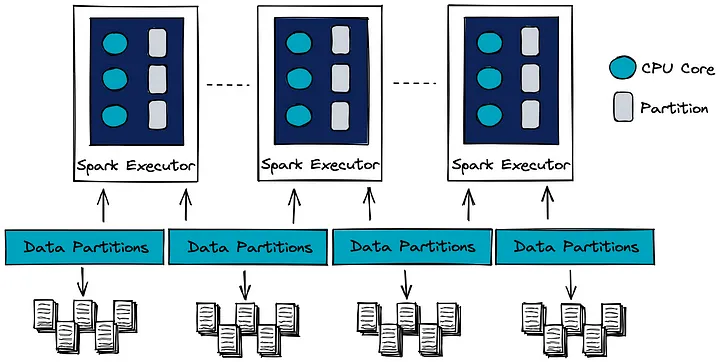
- SparkのTaskはディスクからメモリに読み込まれたPartitionとしてデータを処理
- SparkのPartitionの最大サイズのデフォルト値は128MB
- ファイルサイズの小さいPartitionが多いと、ディスクI/Oが多くなり、パフォーマンスに影響を及ぼす
### データのキャッシュと永続化
- CacheとPersistenceはSparkでは同義だが、cache()とpersist()の2つのAPIコールには違いがあり、persist()はデータの保存方法と場所を詳細に制御可能
- cache()の利用による速度改善の比較
  ```python
  from pyspark.sql import SparkSession
  import time

  spark = SparkSession.builder.getOrCreate()

  # サンプルデータの生成
  data = [(i, i * 2, i * 3) for i in range(1, 1000001)] # 100万行のデータ
  columns = ["col1", "col2", "col3"]
  df = spark.createDataFrame(data, columns)

  # 重い計算を模倣するクエリ（集計処理）
  def perform_heavy_query(df):
      return df.groupBy("col1").agg({"col2": "sum", "col3": "max"})

  # キャッシュを使用しない場合
  start_time_no_cache = time.time()
  result_no_cache = perform_heavy_query(df).collect()
  end_time_no_cache = time.time()
  print(f"Execution time without cache: {end_time_no_cache - start_time_no_cache:.2f} seconds")

  # キャッシュを使用した場合
  df.cache()  # キャッシュを設定
  df.count()  # アクションを実行し、キャッシュをトリガー/マテリアライズ
  start_time_with_cache = time.time()
  result_with_cache = perform_heavy_query(df).collect()
  end_time_with_cache = time.time()
  print(f"Execution time with cache: {end_time_with_cache - start_time_with_cache:.2f} seconds")

  spark.stop() # SparkSessionの停止
  
  """
  Execution time without cache: 13.90 seconds
  Execution time with cache: 4.27 seconds
  """
  ```
- persist()の利用による速度改善の比較
  - persistはStorageLevelを介してデータのcache方法を制御可能（MEMORY_ONLY推奨）
    - MEMORY_ONLY  
      -> データはオブジェクトとしてメモリにのみ保存
    - MEMORY_ONLY_SER  
      -> データはシリアライズされメモリにのみ保存（データ使用時にデシリアライズが必要）
    - MEMORY_AND_DISK  
      -> データはオブジェクトとしてメモリに保存されるが、メモリが足りない場合の残りはシリアライズされてディスクに保存
    - DISK_ONLY  
      -> データはシリアライズされてディスクに保存
    - OFF_HEAP  
      -> データはオフヒープに保存
  ```python
  from pyspark.sql import SparkSession
  from pyspark import StorageLevel
  import time

  spark = SparkSession.builder.getOrCreate()

  # サンプルデータの生成
  data = [(i, i * 2, i * 3) for i in range(1, 1000001)] # 100万行のデータ
  columns = ["col1", "col2", "col3"]
  df = spark.createDataFrame(data, columns)

  # 重い計算を模倣するクエリ（集計処理）
  def perform_heavy_query(df):
      return df.groupBy("col1").agg({"col2": "sum", "col3": "max"})

  # persistを使用しない場合
  start_time_no_persist = time.time()
  result_no_persist = perform_heavy_query(df).collect()
  end_time_no_persist = time.time()
  print(f"Execution time without persist: {end_time_no_persist - start_time_no_persist:.2f} seconds")

  # persistを使用した場合
  df.persist(StorageLevel.DISK_ONLY)  # persistを設定
  df.count()  # アクションを実行し、persistをトリガー/マテリアライズ
  start_time_with_persist = time.time()
  result_with_persist = perform_heavy_query(df).collect()
  end_time_with_persist = time.time()
  print(f"Execution time with persist: {end_time_with_persist - start_time_with_persist:.2f} seconds")
  
  df.unpersist() # ストレージの解除
  spark.stop() # SparkSessionの停止
  
  """
  Execution time without persist: 14.29 seconds
  Execution time with persist: 3.68 seconds
  """
  ```
- cache()やpersist()の使い分け
  - 行うべきケース
    - 機械学習の学習に使われるDataFrame
    - ETLで頻繁に行われる変換のためによくアクセスされるDataFrame
  - 行わないほうが良いケース
    - メモリに収まりきらない大きさのDataFrame
    - 使用頻度の低いDataFrame
### Spark UIの確認
- Windowsでの確認方法
  1. %SPARK_HOME%/conf 内の spark-defaluts.conf に以下の設定を追記
    ```text
    spark.eventLog.enabled              true
    spark.eventLog.dir                  file:/C:/{log_path}    # {log_path}はログを保存する任意のパス
    spark.history.ui.port               18080                  # 過去のログをSpark UIで確認する際のポート
    spark.history.fs.logDirectory       file:/C:/{log_path}    # 過去のログを読み込むパス
    spark.history.retainedApplications  10                     # ログの保存数
    ```
  2. `cd %SPARK_HOME%\bin` でbinディレクトリに移動し、`spark-class org.apache.spark.deploy.history.HistoryServer` を実行
      - Linuxの場合は、`cd %SPARK_HOME%\sbin` でsbinディレクトリに移動し、`start-history-server.sh` を実行
- 確認可能な項目
  - Jobs  
    -> 各JobのDurationを確認でき、実行速度のボトルネックを調査可能
  - Stages  
    -> 各StageのDurationを確認でき、実行速度のボトルネックを調査可能
  - Storage  
    -> CacheされたすべてのテーブルやDataFrameの情報を確認可能
  - Environment  
    -> SparkのConfigに関して、GUI上で詳細に確認可能
  - Executors  
    -> 各Executorのメトリクスについて確認可能
  - SQL/DataFrame  
    -> クエリがいつどのJobで実行されたかを確認可能

## 8章
### 構造化ストリーミング
- https://spark.apache.org/docs/3.5.3/structured-streaming-programming-guide.html
- 構造化ストリーミングがサポートされているのは、インインクリメンタルに実行できるDataFrameオペレーションのみ
  - ステートレス・オペレーション
    - 該当オペレーション
      - 投影オペレーション：select, explode, map, flatmap, etc
      - 選択オペレーション：filter, where, etc
    - サポートモード：append, update, output
      - completeモードがサポートされていないのは、増加し続ける結果データの保持コストが高いため
  - ステートフル・オペレーション
    - 常に DataFrame.groupBy() or DataFrame.groupByKey() を使用する必要がある
    - ウィンドウによる集計  
      -> `streamDF.groupBy("{column_name}", window("{timestamp}", "10 minutes", "5 minutes")).count()`
    - watermarkによる遅延保障：指定時間内のデータは削除しない  
      -> `streamDF.withWatermark("{timestamp}", "10 minutes")groupBy("{column_name}", window("{timestamp}", "10 minutes", "5 minutes")).count()`
- ストリームデータの結合
  - Stream-Static：全ストリームデータに対して結合可能、1つのストリームデータを静的情報でエンリッチ化する際に使用
    - inner-join, left-join (StreamDFが左), right-join (StreamDFが右) をサポート
  - Stream-Stream：両方のデータソースがリアルタイムに変化する際に使用
    - inner-join, outer-join ともにサポート
- sessionizedStreamとセッションウィンドウ
  - 従来のリアルタイム処理では、flatMapGroupWithState()でカスタムのセッションウィンドウロジックが実装されていた
    - 本方法は以下のような課題がある
      - 手動でのステート管理
      - 組み込み集計関数の非対応
      - PySparkでの使用不可
  - session_window()により、動的なウィンドウサイズを持つセッションウィンドウを簡単に作成できるようになった
    - 新規イベントが発生するとウィンドウが開始
    - 状態管理の複雑さが低減
    - 集計処理の実装が簡素化
    - Pythonを含む複数言語で使用可能
- ストリーミングクエリを実行するSparkクラスタのパフォーマンスチューニング
  - ストリーミングクエリを実行するクラスタは常時稼働するため、過不足のないリソースのプロビジョニングが必要
  - Shuffle partitionをバッチクエリの時よりも小さい値に設定し、分割のオーバーヘッドを低減する
  - 急増するデータによる影響を小さくするために、ソースレート制限を設ける
  - 複数のストリーミングクエリを同一のSparkContextもしくはSparkSessionで実行し、クエリ間のリソース共有を可能にする

## 9章
### ストレージソリューションに望まれる特性
- スケーラビリティとパフォーマンス
- ACIDトランザクション
- 多様なデータフォーマットへの対応
- 多様なワークロードへの対応
### SQLワークロードのカテゴリ
- OLTP (On-Line Transaction Process)：リレーショナルデータベースと相性が良い
  - 高並行性
  - 低レイテンシ
  - 1度に数レコードを処理
- OLAP (On-Line Analytics Process)：カラムナデータベースと相性が良い
  - 多数のレコード
  - 高スループット
  - バッチ処理や大規模クエリ処理が中心
### レイクハウスストレージの特徴
- 並列ワークロード下でのACIDトランザクションを保証
- スキーマの強制によるデータ不整合の回避
- 多様なデータ形式のサポート
- 多様なワークロードに対応
- upsertとdeleteの同時実行が可能
- データの変更履歴を監査
### Delta Lakeの利点
- バッチジョブとストリーミングジョブの両方から同じテーブルへの書き込みが可能
- 複数のストリーミングジョブが同じテーブルにデータを追加することが可能
- 同時書き込みでもACIDを保証
### Delta Lakeへのデータのロード
- バッチデータ  
  `spark.read.format("parquet").load({source_path}).write.format("delta").mode("append").option("mergeSchema", "true").save({delta_path})`
- ストリーミングデータ  
  `stream_df.writeStream.format("delta").option("checkpointLocation", {location_path}).trigger(processingTime="10 seconds").start({delta_path})`
### Deltaテーブルのmerge
`delta_table_a.alias("a").merge(delta_table_b.alias("b"), "a.id=b.id").whenMatchedUpdateAll().whenNotMatchedInsertAll().execute()`
### Deltaテーブルの変更履歴の確認とタイムトラベル
- 変更履歴の確認  
  `delta_table.history(3).show()`
- タイムトラベル  
  `spark.read.format("delta").option("timestampAsOf", "2024-01-01").load({delta_path})`

  `spark.read.format("delta").option("versionAsOf", "7").load({delta_path})`
### Deltaテーブルのファイル構成の最適化
- ビンパッキング  
  `delta_table.optimize().executeCompaction()`
- Z-オーダーリング  
  `delta_table.optimize().executeZOrderBy({column})`

## 10章
### Sparkを用いた機械学習
- sparkにはspark.mllibとspark.mlの2つの機械学習パッケージがある
  - spark.mllib：RDD APIに基づき、Spark2.0以降メンテナンスモード
  - spark.ml：DataFrameに基づく新しいAPI
- spark.mlは分散フレームワークのため、scikit-learnのような単一ノードフレームワークと異なり、大規模なデータセットを用いたモデルの構築が可能
- コンポーネント
  - トランスフォーマ
    - データフレームを入力として受け取り、特徴量の変換や追加を行う
    - transformer.transform()の戻り値が、特徴量エンジニアリング後のデータフレーム
  - エスティメータ
    - データからパラメータを学習し、学習済みモデル（トランスフォーマ）を返す
    - estimator.fit()の戻り値がトランスフォーマ
  - パイプライン
    - トランスフォーマとエスティメータの一連の流れを1つのフローとして管理
    - .fit() -> transformer -> .transform() -> DataFrame -> .fit() ...
### 機械学習フローの実装
- データセットの分割
  - ランダム分割
    ```python
    df.randomSplit([0.8, 0.2], seed=42)
    ```
- 特徴量の作成
  - 対数変換：右に裾野が広いデータを正規分布に近づける変換
    ```python
    from pyspark.sql.functions import log, exp

    df = df.withColumn("price_log", log(col("price")))
    
    # 予測結果は指数変換で元のスケールに戻す
    df_pred = df_pred.withColumn("price_pred", exp(col("price_log_pred")))
    ```
  - VectorAssembler：全特徴を1つのベクトルにまとめる
    ```python
    from pyspark.ml.feature import VectorAssembler

    va = VectorAssembler(inputCols=["{col_1}", ..., "{col_N}"], outputCol="features")
    va_df = va.transform(df)
    ```
  - One-Hot Encoding：SparseVectorによる効率的なエンコーディング
    ```python
    categorical_cols = [field for (field, data_type) in train_df.dtypes if data_type == "string"]
    numerical_cols = [field for (field, data_type) in train_df.dtypes if ((data_type != "string") & (field != "price"))]
    index_output_cols = [x+"_index" for x in categorical_cols]
    ohe_output_cols = [x+"_OHE" for x in categorical_cols]

    si = StringIndexer(inputCols=categorical_cols, outputCols=index_output_cols, handleInvalid="skip")
    ohe = OneHotEncoder(inputCols=index_output_cols, outputCols=ohe_output_cols)
    assembler_input_cols = ohe_output_cols + numerical_cols
    va = VectorAssembler(inputCols=assembler_input_cols, outputCol="features")

    # 予測の実行
    lr = LinearRegression(labelCol="price", featuresCol="features")
    pipeline = Pipeline(stages=[si, ohe, va, lr])
    pipeline_model = pipeline.fit(train_df)
    pred_df = pipeline_model.transform(test_df)
    pred_df.show(3)
    ```
    - StringIndexer：文字列のカテゴリデータを数値インデックスに変換
      - カテゴリは出現頻度の降順で並べられ、インデックスが割り当てられる
      - 未知のカテゴリがデータに含まれる場合の挙動は、handleInvalidパラメータで指定可能
        - "error"（デフォルト）：エラーを発生
        - "skip"：無効なエントリをスキップ
        - "keep"：新しいインデックスを割り当て
      ```python
      from pyspark.ml.feature import StringIndexer

      data = spark.createDataFrame([
          (0, "cat"),
          (1, "dog"),
          (2, "mouse"),
          (3, "cat"),
          (4, "dog"),
          (5, "cat")
      ], ["id", "category"])

      indexer = StringIndexer(inputCol="category", outputCol="categoryIndex")
      model = indexer.fit(data)
      indexed = model.transform(data)
      indexed.show()

      """
      +---+--------+-------------+
      | id|category|categoryIndex|
      +---+--------+-------------+
      |  0|     cat|          0.0|
      |  1|     dog|          1.0|
      |  2|   mouse|          2.0|
      |  3|     cat|          0.0|
      |  4|     dog|          1.0|
      |  5|     cat|          0.0|
      +---+--------+-------------+
      """

      new_data = spark.createDataFrame([
          (0, "dog"),
          (1, "rabbit"),
          (2, "horse")
      ], ["id", "category"])

      indexer_skip = StringIndexer(inputCol="category", outputCol="categoryIndex", handleInvalid="skip")
      indexer_keep = StringIndexer(inputCol="category", outputCol="categoryIndex", handleInvalid="keep")
      indexer_error = StringIndexer(inputCol="category", outputCol="categoryIndex", handleInvalid="error")
      indexers = [indexer_skip, indexer_keep, indexer_error]

      for indexer in indexers:
          model = indexer.fit(data)
          indexed = model.transform(new_data)
          indexed.show()
      
      """
      handleInvalid="skip"
      +---+--------+-------------+
      | id|category|categoryIndex|
      +---+--------+-------------+
      |  0|     dog|          1.0|
      +---+--------+-------------+

      handleInvalid="keep"
      +---+--------+-------------+
      | id|category|categoryIndex|
      +---+--------+-------------+
      |  0|     dog|          1.0|
      |  1|  rabbit|          3.0|
      |  2|   horse|          3.0|
      +---+--------+-------------+

      handleInvalid="error"
      ERROR Executor: Exception in task 13.0 in stage 19.0 (TID 161)
      """
      ```
    - OneHotEncoder：カテゴリデータをワンホットエンコーディング形式に変換
      - 出力はスパースベクトル
      - 多重共線性を防ぐために、出力ベクトルの長さは「カテゴリ数-1」
      ```python
      from pyspark.ml.feature import StringIndexer, OneHotEncoder

      data = spark.createDataFrame([
          (0, "cat"),
          (1, "dog"),
          (2, "mouse"),
          (3, "cat"),
          (4, "dog"),
          (5, "cat")
      ], ["id", "category"])

      indexer = StringIndexer(inputCol="category", outputCol="categoryIndex")
      indexed_data = indexer.fit(data).transform(data)
      encoder = OneHotEncoder(inputCol="categoryIndex", outputCol="categoryVec")
      encoded_data = encoder.fit(indexed_data).transform(indexed_data)
      encoded_data.show()

      """
      +---+--------+-------------+-------------+
      | id|category|categoryIndex| categoryVec |
      +---+--------+-------------+-------------+
      |  0|     cat|          0.0| (2,[0],[1.0])|
      |  1|     dog|          1.0| (2,[1],[1.0])|
      |  2|   mouse|          2.0|     (2,[],[])|
      |  3|     cat|          0.0| (2,[0],[1.0])|
      |  4|     dog|          1.0| (2,[1],[1.0])|
      |  5|     cat|          0.0| (2,[0],[1.0])|
      +---+--------+-------------+-------------+
      """
      ```
  - RFormula：自動的にStringIndexerとOneHotEncoderを実施
    - ツリー系のメソッドの場合、ワンホットエンコーディングを使用すると、むしろ精度が悪化するため注意が必要
    ```python
    from pyspark.ml.feature import RFormula

    r_formula = RFormula(formula="price ~.", 
                          featureCol="features", 
                          labelCol="price", 
                          handleInvalid="skip")

    # 予測の実行
    pipeline = Pipeline(stages=[r_formula, lr])
    pipeline_model = pipeline.fit(train_df)
    pred_df = pipeline_model.transform(test_df)
    pred_df.show(3)
    ```
- モデル作成
  - 線形回帰
    ```python
    from pyspark.ml.regression import LinearRegression

    lr = LinearRegression(featuresCol="features", labelCol="price", regParam=0.01)
    model = lr.fit(va_train_df)
    print(f"{model.coefficients=}", f"{model.intercept=}")
    ```
  - ランダムフォレスト
    - ブートストラップサンプリングにより、各決定木は異なる特徴を学習し、モデルの多様性が向上し、汎化性が高くなる
      - サンプリング時に元のデータの約63.2%程度が使われる（1つのデータ点が選ばれない確率が (1−1/N)^N = 1/e であるため）
    - 分岐の列選択により、各決定木間の相関を小さくし、アンサンブルの性能を向上させる
    ```python
    from pyspark.ml.regression import RandomForestRegressor

    # ランダムフォレストによる予測
    rfr = RandomForestRegressor(labelCol="price")

    # 使用カラムの選定
    categorical_cols = [field for (field, data_type) in train_df.dtypes if data_type == "string"]
    numerical_cols = [field for (field, data_type) in train_df.dtypes if ((data_type != "string") & (field != "price"))]
    index_output_cols = [x+"_index" for x in categorical_cols]

    # データ前処理
    si = StringIndexer(inputCols=categorical_cols, outputCols=index_output_cols, handleInvalid="skip")
    assembler_input_cols = index_output_cols + numerical_cols
    va = VectorAssembler(inputCols=assembler_input_cols, outputCol="features")

    # 学習と予測の実行
    pipeline = Pipeline(stages=[si, va, rfr])
    pipeline_model = pipeline.fit(train_df)
    pred_df = pipeline_model.transform(test_df)

    # 予測精度の評価
    re = RegressionEvaluator(predictionCol="prediction", labelCol="price", metricName="rmse")
    rmse = re.evaluate(pred_df)
    print(rmse)

    # 分岐の可視化
    model = pipeline_model.stages[-1]
    # print(model.toDebugString)

    # 特徴量重要度の可視化
    feature_importance = pd.DataFrame(
        list(zip(va.getInputCols(), model.featureImportances)),
        columns=["feature", "importance"]
    )
    feature_importance.sort_values(by="importance", ascending=False, inplace=True)
    print(feature_importance.head(5))
    ```
- 処理のパイプライン化
  - パイプラインAPIの利点は、どのステージが Estimator/Transformer かを自動的に決定するため、各ステージの .fit()/.transform() を指定する必要がなくなる
    ```python
    from pyspark.ml import Pipeline

    pipeline = Pipeline(stages=[va, lr])
    pipeline_model = pipeline.fit(train_df)
    ```
- 予測の実行
  ```python
  pred_df = pipeline_model.transform(test_df)
  ```
- モデルの読み書き
  - 通常、保存したモデルを読み込むには、モデルの型を指定する必要がある
  - パイプラインモデルを作成することで、すべてのモデルをPipelineModelで読み込み可能となり、モデルの型指定が不要となる
  ```python
  # 書き込み
  pipeline_model.write().overwrite().save("{save_path}")

  # 読み込み
  from pyspark.ml import PipelineModel
  model = PipelineModel.load("{save_path}")
  ```
- 交差検証：最適なハイパーパラメータを選択したり、アーリーストッピングのタイミングを判断するために使用
  - 実行速度を最適化するための改善策
    - 並列トレーニング（データの大小に関わらず効果的）
    - 交差検証をパイプラインに組み込む（データが大きいときに効果的）
  ```python
  from pyspark.ml.tuning import ParamGridBuilder, CrossValidator

  spark.sparkContext.setLogLevel("ERROR")     # WARN を非表示に変更

  param_grid = ParamGridBuilder().addGrid(rfr.maxDepth, [5, 10]).addGrid(rfr.numTrees, [100, 200]).build()
  cv = CrossValidator(estimator=pipeline, evaluator=re, estimatorParamMaps=param_grid, numFolds=3, seed=42)

  # 実行速度最適化前
  start = time.time()
  cv_model = cv.fit(train_df)
  # pprint(list(zip(cv_model.getEstimatorParamMaps(), cv_model.avgMetrics)))
  elapse_before = time.time() - start
  print(f"{elapse_before=}")

  # 実行速度最適化後（並列トレーニング）
  start = time.time()
  cv_model = cv.setParallelism(4).fit(train_df)
  # pprint(list(zip(cv_model.getEstimatorParamMaps(), cv_model.avgMetrics)))
  elapse_parallel = time.time() - start
  print(f"{elapse_parallel=}")

  # 実行速度最適化後（交差検証をパイプラインに組み込む）
  start = time.time()
  cv = CrossValidator(estimator=rfr, evaluator=re, estimatorParamMaps=param_grid, numFolds=3, parallelism=4, seed=42)
  pipeline = Pipeline(stages=[si, va, cv])
  pipeline_model = pipeline.fit(train_df)
  # pprint(list(zip(cv.getEstimatorParamMaps(), pipeline_model.stages[-1].avgMetrics)))
  elapse_pipeline = time.time() - start
  print(f"{elapse_pipeline=}")

  """
  elapse_before=16.84671664237976
  elapse_parallel=8.8700430393219
  elapse_pipeline=8.542184829711914
  """
  ```
## 11章
### MLflowの構成
- トラッキング：パラメータ、メトリクス、コードバージョン、モデル、アーティファクトを記録
- プロジェクト：依存関係をパッケージ化し、プロジェクト管理を支援
- モデル：異なる実行環境にデプロイするためのモデルをパッケージ化
- レジストリ：モデルのリネージ、モデルのバージョン、ステージ遷移、アノテーションを記録
### トラッキング
- Experimentの中に、複数のRunを集約
```python
import mlflow
from pyspark.sql import SparkSession
from pyspark.sql.types import *
from pyspark.sql.functions import *
from pyspark.ml.feature import VectorAssembler
from pyspark.ml.regression import LinearRegression
from pyspark.ml import Pipeline
from pyspark.ml.evaluation import RegressionEvaluator

spark = SparkSession.builder.getOrCreate()

# データセットの読込み
file_path = ""
df = spark.read.format("csv").option("header", "true").load(f"{file_path}")
df_transformed = (df.withColumn("price", df["price"].cast(IntegerType()))
                    .withColumn("area", df["area"].cast(IntegerType()))
                    )

# データセットの分割
train_df, test_df = df_transformed.randomSplit([0.8, 0.2], seed=42)
print(train_df.count(), test_df.count())

# 特徴量の作成
input_cols = ["area"]
output_col = "features"
va = VectorAssembler(inputCols=input_cols, outputCol=output_col)
va_train_df = va.transform(train_df)
va_train_df.select("area", "features", "price").show(3)

# 線形回帰
lr = LinearRegression(featuresCol="features", labelCol="price", regParam=0.01)
model = lr.fit(va_train_df)
pipeline = Pipeline(stages=[va, lr])
pipeline_model = pipeline.fit(train_df)
pred_df = pipeline_model.transform(test_df)
save_filename = "pred_df.parquet"
pred_df.write.mode("overwrite").parquet(save_filename)

# 予測精度の評価
re = RegressionEvaluator(predictionCol="prediction", labelCol="price", metricName="rmse")
rmse = re.evaluate(pred_df)

# MLflow
mlflow.start_run(run_name="mlflow-test")
run = mlflow.active_run()
print(f"Active run_id: {run.info.run_id}")
mlflow.log_param("input_cols", input_cols)
mlflow.log_param("output_col", output_col)
mlflow.spark.log_model(pipeline_model, "model")
mlflow.log_metric("rmse", rmse)
mlflow.log_artifact(f"{save_filename}")
mlflow.end_run()
print("execute 'mlflow ui' in another terminal and access http://127.0.0.1:5000")
```
")
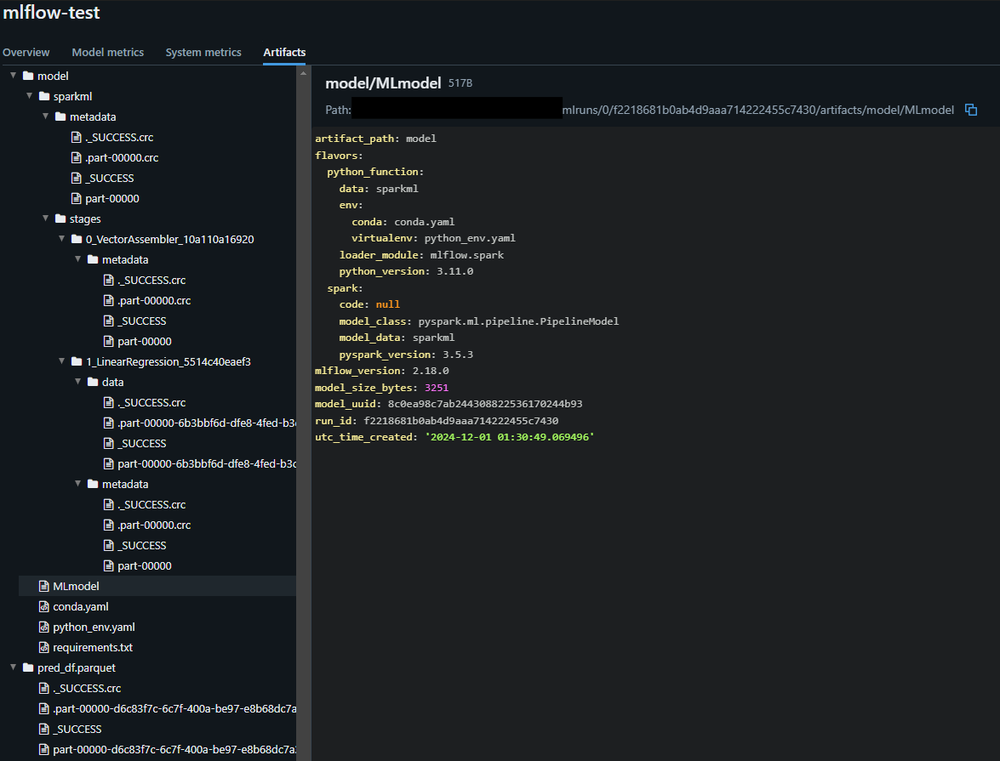
### MLflowに登録したモデルを用いた推論
- バッチ
  - MLlibはオンラインアップデートやウォームスタートをサポートしていないため、最新データをモデルにとりこむには、モデル全体を再学習する必要があり、再学習の指針としては以下の2つがある
    - 定期的なモデル再学習の実行
    - ドリフトを監視し再学習タイミングを特定
  ```python
  import mlflow
  from pyspark.sql import SparkSession
  from pyspark.sql.types import *

  spark = SparkSession.builder.getOrCreate()
  spark.sparkContext.setLogLevel("ERROR")     # WARN を非表示に変更

  df = spark.read.format("csv").option("header", "true").load("C:/Users/{user_name}/my-env/sandbox/LearningSparkV2-master/chapter11/py/data/Housing.csv")
  df_transformed = (df.withColumn("price", df["price"].cast(IntegerType()))
                      .withColumn("area", df["area"].cast(IntegerType()))
                      )

  # mlflow.spark.load_modelは、Spark環境が必要な処理
  # この処理を実行する前に、SparkSessionの初期化が必要
  run_id = "f2218681b0ab4d9aaa714222455c7430"
  pipeline_model = mlflow.spark.load_model(f"runs:/{run_id}/model")
  pred_df = pipeline_model.transform(df_transformed)
  pred_df.show(3)
  ```
- ストリーミング
  - ストリーミング予測の場合は、入力データをストリーミング読み込みに変更するだけで、推論パイプラインに対する変更は不要
  - Sparkではドライバ・ワーカー間でオーバーヘッドが発生するため、低レイテンシが必要な予測の場合は、モデルをSparkからエクスポートする必要がある
    - エクスポートの際は、ONNX（Open Neural Network Exchange）フォーマットが便利
### 非MLlibモデルでのSparkを活用した分散型ハイパーパラメータチューニング
- Joblib
  - データのコピーをすべてのワーカーにブロードキャストし、各ワーカーは異なるハイパーパラメータで独自のモデルを作成
  - 1つのモデルとすべてのデータが1台のマシンに収まらなければならないという制約あり
  - Spark以外のバックエンドもサポートしており、各バックエンドの特徴は以下の通り
    - loky（デフォルト）
      - プロセスベースの並列化
      - 各プロセスが独立したPythonインタープリタを持つため、GIL（Global Interpreter Lock）の影響を受けない
      - メモリ共有が制限されるため、大規模なデータを扱う場合にはメモリ消費が増加する可能性がある
    - threading
      - スレッドベースの並列化
      - メモリ消費が低く、データのコピーが不要
      - GILの影響を受けるため、CPUバウンドなタスクではスケーラビリティが制限される
    - dask
      - 分散システムや大規模なデータセットに最適化
      - 並列処理の拡張性が高く、クラスター環境でも動作可能
      - データの分散管理やタスクスケジューリングが柔軟
    - spark（joblib-sparkが必要）
      - Apache Sparkを利用した分散処理
      - クラスタ環境での大規模データ処理に適している
      - Sparkのエコシステムと統合可能
  ```python
  import time
  import joblib
  import pandas as pd
  from sklearn.ensemble import RandomForestRegressor
  from sklearn.utils import parallel_backend
  from sklearn.model_selection import train_test_split, GridSearchCV
  from joblibspark import register_spark
  from pyspark import SparkContext

  df = pd.read_csv("LearningSparkV2-master/chapter11/py/data/Housing.csv")
  df_encoded = pd.get_dummies(df, columns=[
      "mainroad", "guestroom", "basement", "hotwaterheating",
      "airconditioning", "prefarea", "furnishingstatus"
  ])
  X = df_encoded.drop(columns=["price"])
  y = df_encoded["price"]

  X_train, X_test, y_train, y_test = train_test_split(X, y, random_state=42)
  reg = RandomForestRegressor(random_state=42)
  param_grid = {"max_depth": [2, 5, 10], "n_estimators": [20, 50, 100]}
  gscv = GridSearchCV(reg, param_grid, cv=3)

  # 順次実行
  start = time.time()
  gscv.fit(X_train, y_train)
  elapse_sequential = time.time() - start
  print(f"{elapse_sequential=}")

  # 分散実行
  register_spark()
  sc = SparkContext.getOrCreate()
  sc.addPyFile("dependencies.zip")  # 依存関係を追加
  start = time.time()
  # # BackendとしてSparkを使用できない場合は、"loky", "threading"も指定可能
  with joblib.parallel_backend("spark", n_jobs=3):
      gscv.fit(X_train, y_train)
  elapse_parallel = time.time() - start
  print(f"{elapse_parallel=}")

  ```
- Hyperopt
  - スケールアウトの方法は以下の2つがある
    - 分散トレーニングアルゴリズム（MLlib）を使用した単一マシン上でHyperoptを使用
      ```python
      from pyspark.sql import SparkSession
      from pyspark.ml.regression import RandomForestRegressor
      from pyspark.ml import Pipeline
      from pyspark.ml.feature import VectorAssembler
      from hyperopt import fmin, tpe, hp, Trials
      from hyperopt import STATUS_OK

      spark = SparkSession.builder.getOrCreate()

      # データの読み込み
      data = spark.read.csv("path/to/your/data.csv", header=True, inferSchema=True)
      feature_columns = ['feature1', 'feature2', 'feature3']  # 特徴量のカラム名
      assembler = VectorAssembler(inputCols=feature_columns, outputCol='features')
      data = assembler.transform(data)

      # ハイパーパラメータの最適化のための目的関数
      def objective(params):
          rf = RandomForestRegressor(numTrees=int(params['numTrees']),
                                      maxDepth=int(params['maxDepth']),
                                      seed=42)
          model = rf.fit(data)
          predictions = model.transform(data)
          rmse = predictions.selectExpr("sqrt(mean((label - prediction) * (label - prediction))) as rmse").first().rmse
          return {'loss': rmse, 'status': STATUS_OK}

      # ハイパーパラメータの探索空間
      space = {
          'numTrees': hp.choice('numTrees', [10, 20, 50, 100]),
          'maxDepth': hp.choice('maxDepth', [5, 10, 15, 20])
      }

      # 最適化の実行
      trials = Trials()
      best = fmin(fn=objective, space=space, algo=tpe.suggest, max_evals=50, trials=trials)
      print("最適なハイパーパラメータ:", best)
      ```
    - SparkTrialsクラスを使用した分散Hyperoptの使用
      ```python
      from pyspark.sql import SparkSession
      from pyspark import SparkContext
      from hyperopt import fmin, tpe, hp, SparkTrials
      from sklearn.ensemble import RandomForestRegressor
      from sklearn.metrics import mean_squared_error
      import numpy as np

      spark = SparkSession.builder.getOrCreate()
      sc = SparkContext.getOrCreate()

      data = spark.read.csv("path/to/your/data.csv", header=True, inferSchema=True).toPandas()
      X = data[['feature1', 'feature2', 'feature3']]  # 特徴量のカラム名
      y = data['label']  # ラベルのカラム名

      # ハイパーパラメータの最適化のための目的関数
      def objective(params):
          rf = RandomForestRegressor(n_estimators=int(params['n_estimators']),
                                      max_depth=int(params['max_depth']),
                                      random_state=42)
          rf.fit(X, y)
          predictions = rf.predict(X)
          rmse = np.sqrt(mean_squared_error(y, predictions))
          return rmse

      # ハイパーパラメータの探索空間
      space = {
          'n_estimators': hp.choice('n_estimators', [10, 50, 100, 200]),
          'max_depth': hp.choice('max_depth', [5, 10, 15, None])
      }

      # SparkTrialsを使用して最適化の実行
      trials = SparkTrials(parallelism=4)  # 並列処理の数を指定
      best = fmin(fn=objective, space=space, algo=tpe.suggest, max_evals=50, trials=trials)
      print("最適なハイパーパラメータ:", best)
      ```
## 12章
### DataFrameの種類
- Pandas: pandas.DataFrame
  - メモリ内で動作し、データの操作が高速
  - 小規模データセットに適している
  ```python
  import pandas as pd
  df_pandas = pd.read_csv('data.csv')
  ```
- Pandas API on Spark: pyspark.pandas.DataFrame
  - PandasのAPIがSpark上で利用可能
  - 大規模データセットに適しており、分散処理が可能
  - Pandasの機能を活用しつつ、Sparkのスケーラビリティを持つ
  ```python
  import pyspark.pandas as ps
  df_spark_pandas = ps.read_csv('data.csv')
  ```
- Spark SQL: pyspark.sql.DataFrame
  - Sparkの分散データフレーム
  - SQLクエリを使用してデータを操作
  - 大規模データ処理に最適で、クラスター全体でデータを処理
  ```python
  from pyspark.sql import SparkSession
  spark = SparkSession.builder.getOrCreate()
  df_spark_sql = spark.read.csv('data.csv', header=True, inferSchema=True)
  ```
### 関数の使い分け
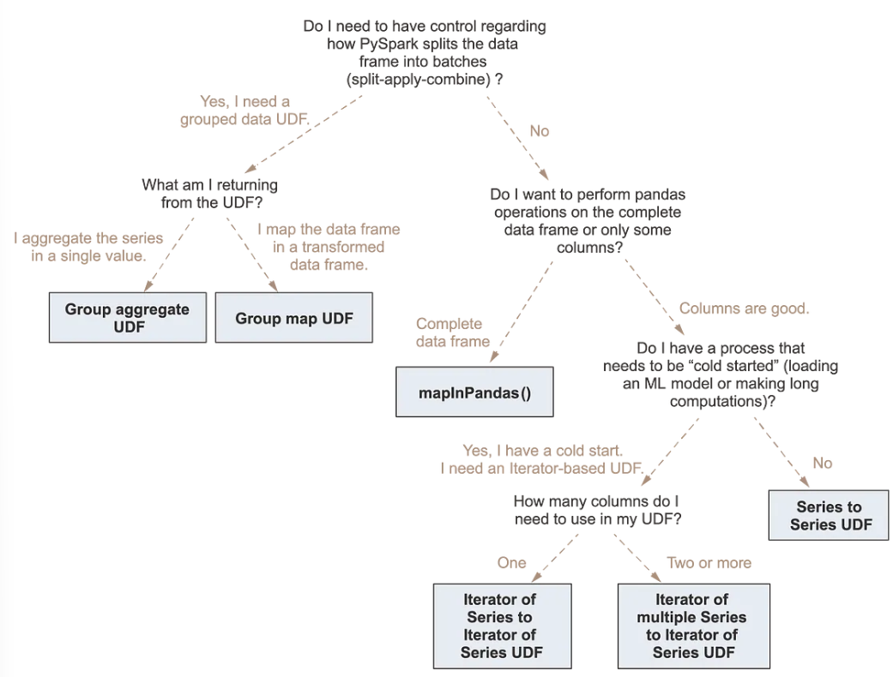
- PySparkのDataFrameに対して処理を行いたい場合、以下のようにPySpark標準の処理、Pandas UDFを用いた処理、Pandas function APIを用いた処理がある
  - ただし、分散型のPandasオペレーションよりもネイティブのSpark関数を用いた方が高速
  - Sparkを使えない場合のフォールバックとしてのみ、分散Pandas関数を使うべき
- また[Pandas API on Spark](https://spark.apache.org/docs/latest/api/python/user_guide/pandas_on_spark/index.html)を用いることで、pandasのAPIをSpark上で利用可能になり、かつpandasの使いやすさとSparkのスケーラビリティを兼ね備えるため、Pandas UDFやPandas function APIを使用する前に、**Pandas API on Sparkの使用を検討**するとよい
  - Sparkでネイティブに実装されていない処理の場合や、Pandas API on Sparkで実装されていない複雑なオペレーションを実行する場合は、Pandas UDF、Pandas function APIを活用
- PySpark
  ```python
  data = [(1, 10.0), (2, 20.0), (3, 30.0)]
  columns = ["id", "value"]
  df = spark.createDataFrame(data, columns)

  result_df = df.withColumn("value_doubled", col("value")*2)
  result_df.show()
  ```
- Pandas UDF
  - pandasがデータを操作する際にApache Arrowを使用
  - pandas UDF ではベクトル化操作が可能で、一度に1行ずつ処理する Python UDF と比較してパフォーマンスが良い
  ```python
  data = [(1, 10.0), (2, 20.0), (3, 30.0)]
  columns = ["id", "value"]
  df = spark.createDataFrame(data, columns)

  # pandas_udfの定義
  @pandas_udf(DoubleType())
  def multiply_by_two(values):
      return values * 2

  result_df = df.withColumn("value_doubled", multiply_by_two(df["value"]))
  result_df.show()
  ```
- Pandas function API
  - pandasがデータを操作する際にApache Arrowを使用
  - pandas UDFと同じ性質
  - pandas function APIには3つのタイプがある
    - [Map](https://spark.apache.org/docs/latest/api/python/reference/pyspark.sql/api/pyspark.sql.DataFrame.mapInPandas.html#pyspark-sql-dataframe-mapinpandas)
      - pandasのインスタンスを用いたmapオペレーションを実行
      - 内部の関数は、pandas.DataFrameのイテレータを受け取り、pandas.DataFrameのイテレータを返却するように実装
      - 各行に対してPandasの処理を適用し、複数の行を出力可能
    - [Grouped map](https://spark.apache.org/docs/latest/api/python/reference/pyspark.sql/api/pyspark.sql.GroupedData.applyInPandas.html#pyspark-sql-groupeddata-applyinpandas)
      - 「split-apply-combine」パターンを実装するためにgroupBy().applyInPandas()を通じて、グループ分けされたデータの変換を行う
      - 「split-apply-combine」は3つのステップから構成される
        - DataFrame.groupByを用いてデータをグループに分割
        - 各グループに関数を適用（関数の入力、出力はともにpandas.DataFrame）
        - 新たなDataFrameに結果を統合
      - groupBy().applyInPandas()を使用するには、以下を定義する必要がある
        - 各グループに対する処理を定義するPython関数
        - 出力DataFrameのスキーマを定義するStructTypeオブジェクトあるいは文字列
    - Cogrouped map
      - 共通のキーでグループ結合される2つのPySpark DataFrameに対して、groupby().cogroup().applyInPandas()を使用
      - 変換は以下の3つのステップから構成される
        - 各データフレームでキーを同じくするグループのデータがシャッフルされ、同じ共通グループにまとめられる
        - 各グループに関数を適用（関数の入力、出力はともにpandas.DataFrame）
        - 新たなDataFrameに結果を統合
      - groupBy().cogroup().applyInPandas()を使用するには、以下を定義する必要がある
        - 各グループに対する処理を定義するPython関数
        - 出力DataFrameのスキーマを定義するStructTypeオブジェクトあるいは文字列
  ```python
  data = [(1, 10.0), (2, 20.0), (3, 30.0)]
  columns = ["id", "value"]
  df = spark.createDataFrame(data, columns)

  # mapInPandasを使用してvalue列を2倍にする関数
  def double_value(iterator):
      for pdf in iterator:
          pdf["value_doubled"] = pdf["value"] * 2
          yield pdf

  # mapInPandasの適用
  result_df = df.mapInPandas(double_value, schema="id long, value double, value_doubled double")
  result_df.show()
  ```

## 参照
- https://waltyou.github.io/Learning-Spark-0/
- https://www.analyticsvidhya.com/blog/2022/07/spark-sql-for-relational-databases/
- https://www.modb.pro/db/70339
- https://towardsdatascience.com/6-recommendations-for-optimizing-a-spark-job-5899ec269b4b
- https://medium.com/@arjun289singh/a-comprehensive-overview-of-apache-spark-unleashing-the-power-of-distributed-computing-31aa0d1643fc
- https://qiita.com/taka_yayoi/items/0fe6534824797b630176
- https://qiita.com/taka_yayoi/items/bfe8fda543ebf0b761fb
- https://livebook.manning.com/book/pyspark-in-action/chapter-9/
