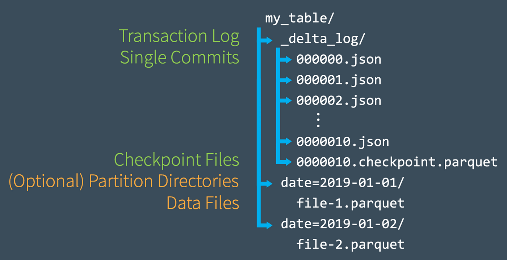
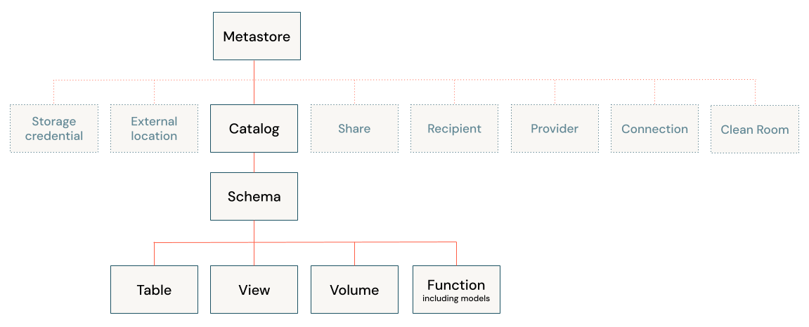
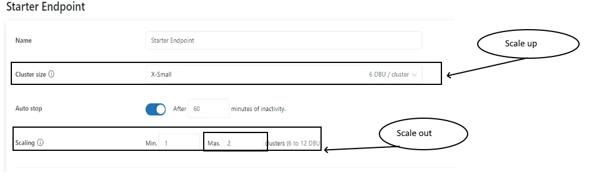
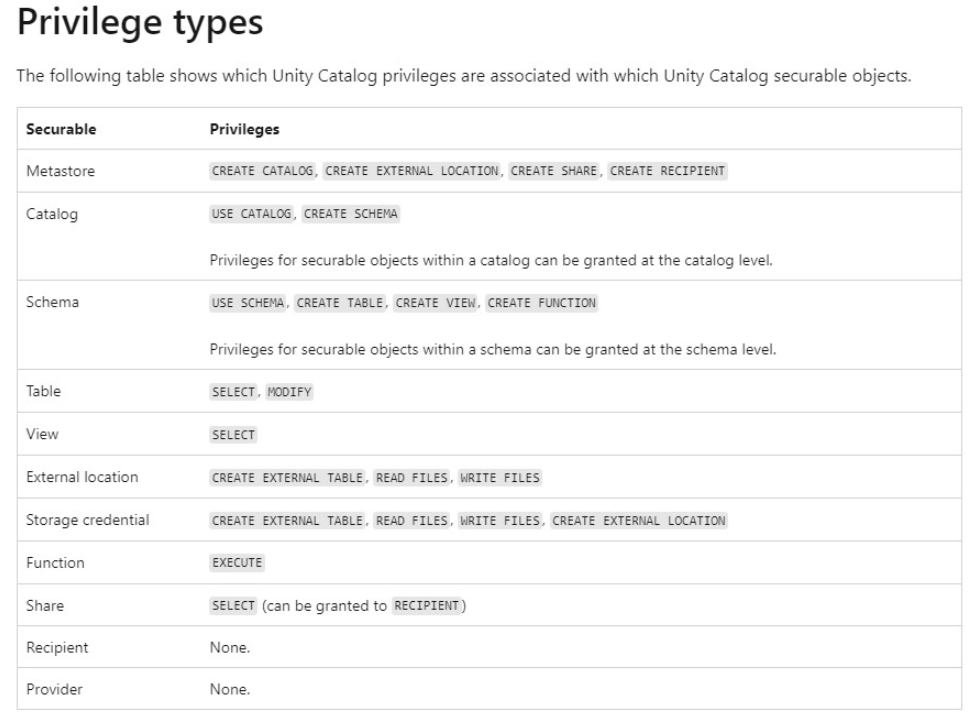
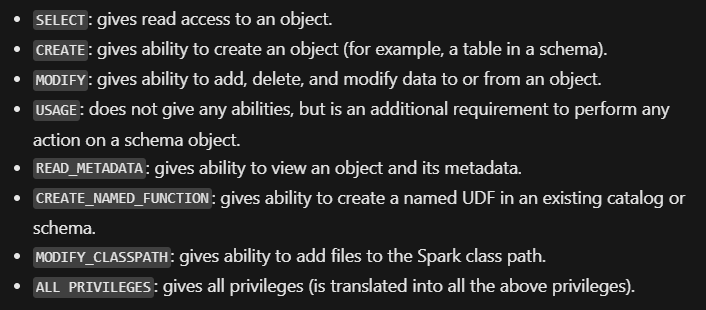
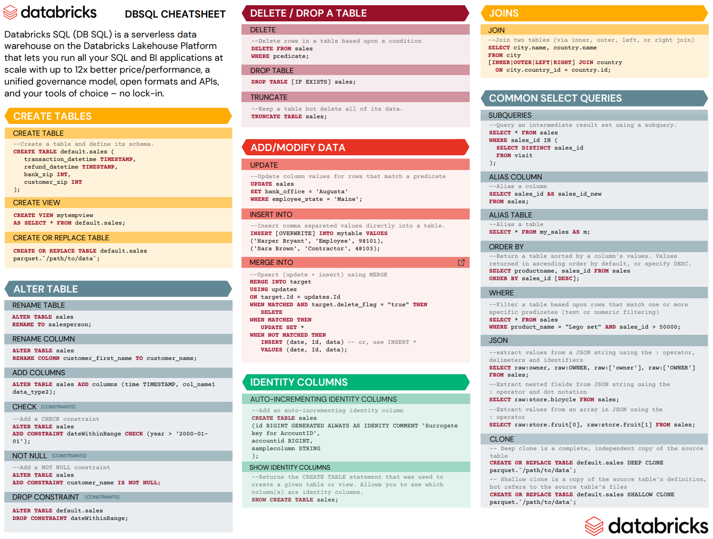
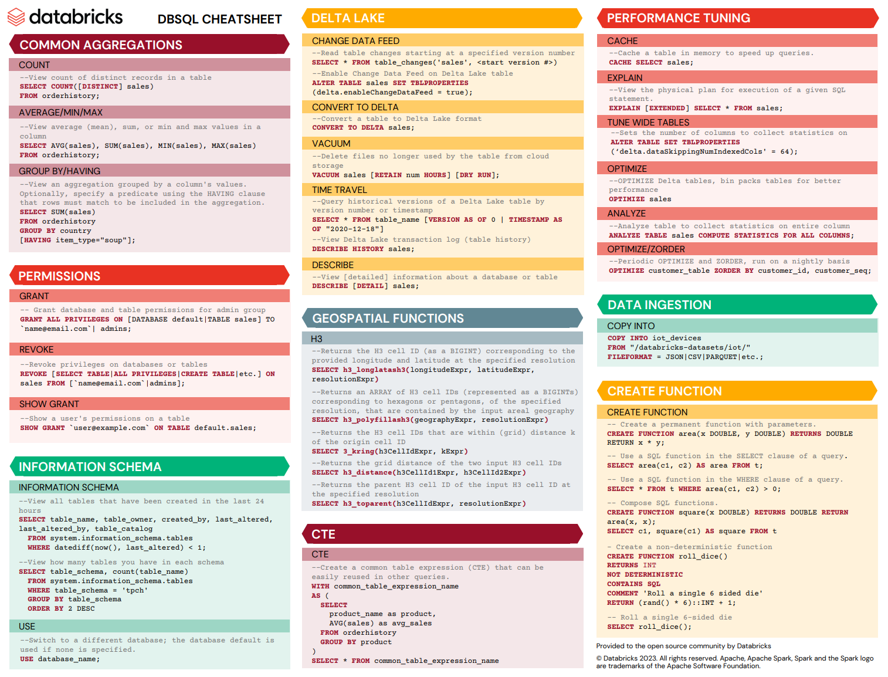
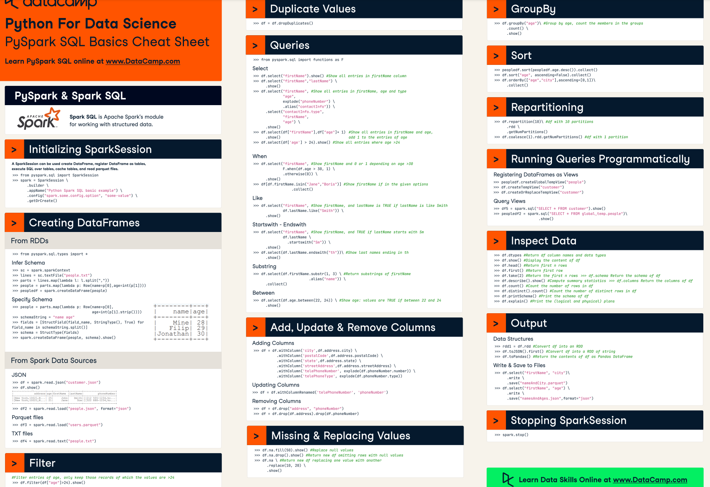
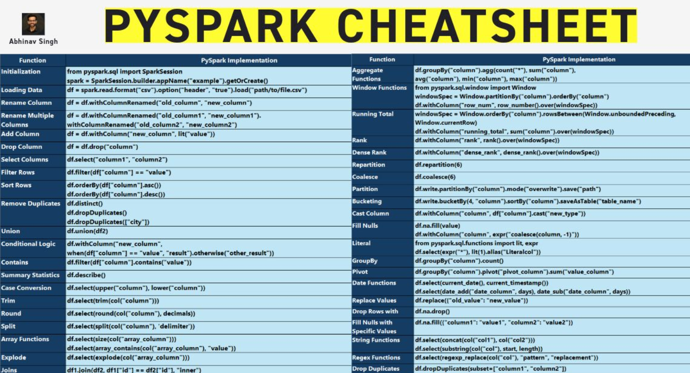

+++
title = 'Databricks Certified Data Engineer Associate 試験勉強まとめ'
subtitle = ""
date = 2024-10-26
lastmod = 2024-10-26
draft = false
KaTex = false
author = "Tuuutti"
authorLink = ""
description = ""
license = "MIT"
images = []
tags = ["Databricks", "試験"]
categories = ["Databricks"]
featuredImage = ""
featuredImagePreview = ""
isCJKLanguage = true
hiddenFromHomePage = false
hiddenFromSearch = false
twemoji = false
lightgallery = true
ruby = true
fraction = true
fontawesome = true
linkToMarkdown = true
rssFullText = false
+++

<!--more-->
# 試験勉強に使用した教材
## 公式
- [Data Engineer Associate Exam Guide](https://www.databricks.com/sites/default/files/2024-06/databricks-certified-data-engineer-associate-exam-guide.pdf)
- [SQL language reference](https://docs.databricks.com/ja/sql/language-manual/index.html)

## Udemy
- [Databricks Certified Data Engineer Associate - Preparation](https://www.udemy.com/course/databricks-certified-data-engineer-associate)
- [Practice Exams: Databricks Certified Data Engineer Associate](https://www.udemy.com/course/practice-exams-databricks-certified-data-engineer-associate)
- [Databricks Certified Data Engineer Associate Practice Exams](https://www.udemy.com/course/databricks-certified-data-engineer-associate-practice-tests)

## その他
- [Databricks Certified Data Engineer Associate Exam](https://www.examtopics.com/exams/databricks/certified-data-engineer-associate/)
- [Z-Order Visualized](https://www.youtube.com/watch?v=ncqSjHeZTxU)
- [Data Science Cheat Sheets](https://www.datacamp.com/cheat-sheet)

# まとめ
## プラットフォーム
- 以下２つの構成に分離されている
  - Control Plane (Databricks Account) : Web UI, Cluster Management, Workflows, Notebooks, Jobs
  - Data Plane (Cloud Account) : Cluster VMs, Compute Resources, Storage
- Apache Sparkは、複数のVMに対してインメモリの分散処理が可能
- DBFSは、抽象化されたファイルシステムで、ファイルの実体はAWS S3やAzure Blob Storageなどのクラウドストレージに保存される
- Clusterは、以下２つのNodeから選択可能
  - Multi-Node : ドライバーノードとワーカーノードから構成される
  - Single Node : ドライバーノードのみから構成される
- Delta Lakeの特徴
  - Open Sourceの分散データレイクプラットフォームで、Proprietary (独自の、専有の) な技術ではない
  - ストレージフレームワークであり、特定のストレージフォーマットのことではない
  - Lakehouseであり、WarehouseやDatabaseではない
  - ファイルはParquetフォーマットで保存され、ファイルのtransactionログも、_delta_log 配下にトランザクションごとにjsonファイルに記録される
    
  - ACIDトランザクションを提供
- Hive Metastoreは、メタデータのリポジトリであり、テーブル定義・データフォーマット・データの保存先などに関するメタデータを保持している
- Unity Catalog の階層構造
  

## スクリプト
### マジックコマンド
- %run コマンドを使用することで、Databricks上の他のNotebookを実行可能 (他のNotebookで宣言した変数も共有される)
- %shコマンドを使用することで、Databricks上のVMでシェルコマンドを実行可能
- `dbutils.help()` で、dbutilsのヘルプを参照可能
- `%fs ls {table_location}` で、テーブルのParquetとトランザクションログの実態を確認可能

### SQL
- `CREATE SCHEMA/DATABASE {db_name}` で、新規データベースを作成可能
  - デフォルト (LOCATION句で指定しない場合) では、dbfs:/user/hive/warehouse に作成される
- `CREATE TABLE IF NOT EXISTS {table_name}` で、既に同一テーブル名のテーブルが作成されている場合を除いて、新規テーブルを作成可能
  - デフォルト (LOCATION句で指定しない場合) では、dbfs:/user/hive/warehouse/{db_name}.db に作成される
- データとメタデータの確認方法
  - `DESCRIBE DETAIL/EXTENDED {table_name}` で、テーブルに関する情報を確認可能
  - `DESCRIBE HISTORY {table_name}` で、テーブルの更新履歴を確認可能
  - `DESCRIBE SCHEMA/DATABASE DETAIL/EXTENDED {db_name}` で、DBに関する情報を確認可能
- 過去のデータを確認する方法
  - `SELECT * FROM {table_name} TIMESTAMP AS OF {yyyy-mm-dd}`
  - `SELECT * FROM {table_name} VERSION AS OF {version_number}`
  - `SELECT * FROM {table_name}@v{version_number}`
- 過去のデータにロールバックする方法
  - `RESTORE TABLE {table_name} TO TIMESTAMP AS OF {yyyy-mm-dd}`
  - `RESTORE TABLE {table_name} TO VERSION AS OF {version_number}`
- データ保持方法の最適化
  - `OPTIMIZE {table_name}`
  - `OPTIMIZE {table_name} ZORDER BY {column_name}`
- 最新データと関連のないParquetファイルの削除
  - `VACUUM {table_name} {retention period (optional: default=7)}`
  - VACUUM を実行すると、retention period 以上の Time Travel ができなくなることに注意
- CTAS文では、自動でスキーマが推論され、マニュアルで宣言することはできない
- テーブルに対する制約の付加
  - `ALTER TABLE {table_name} ADD CONSTRAINT {constraint_name} {constraint_details} {option}`
    - optionの種類
      - None (デフォルト) : 条件に適合しないデータも更新するものの、不適なデータとしてログを記録
      - DROP ROW : 条件に適合しないデータは更新せず、不適なデータとしてログを記録
      - FAIL UPDATE : 条件に適合しないデータが１つでもあれば、全てのデータ更新が無効となる
- テーブルオーナーの変更
  - `ALTER TABLE {table_name} OWNER TO {new_owner_mail/new_owner_group}`
- テーブルプロパティの作成と変更
  - `CREATE TABLE {table_name} ({column_name} {type}) TBLPROPERTIES ({property_name} = {property})`
  - `ALTER TABLE {table_name} SET TBLPROPERTIES ({property_name}, {property})`
- データのクローン (テーブルに対するテストの際に役立つ、ソーステーブルに対する変更は発生しない)
  - Deep Clone : データとメタデータを完全にコピー、データサイズによってはクローンに時間を要する
    - `CREATE TABLE {table_name} DEEP CLONE {source_table}`
  - Shallow Clone : Delta transaction log　のみをコピー
    - `CREATE TABLE {table_name} SHALLOW CLONE {source_table}`
- ビュー (SQLクエリにテーブル名を付与したオブジェクトで、テーブルが呼び出されるたびにクエリが実行される)
  - Stored Views : 永続的なオブジェクト
    - `CREATE VIEW {view_name} AS {sql_query}`
    - `DROP VIEW {view_name}` で削除
  - Temporary Views : セッション内のみ有効なオブジェクト (Notebookの切り替えやClusterの再起動などでセッションが新しく確立される)
    - `CREATE TEMP VIEW {view_name} AS {sql_query}`
    - セッションが切れたら、自動的に削除される
  - Global Temporary Views : 起動中のCluster内で有効なオブジェクト (同じClusterを起動している複数のNotebookから参照可能)
    - `CREATE GLOBAL TEMP VIEW {view_name} AS {sql_query}`
    - クラスターが終了したら、自動的に削除される
    - Global Temp View のみ、ビューを参照する際に、`global_temp.{view_name}` と記載する必要がある
    - `SHOW TABLES IN global_temp` で Global Temp View の一覧を確認可能 (Global Temp View は global_temp に保存される)
- ファイルのクエリ
  - `SELECT * FROM {file_format}.{file_path}`
  - LOCATION 句を使用すると、外部テーブルとしてテーブルが作成される
  - CTAS文のソースファイルとしてファイルを指定する際に、スキーマの推論がうまくいかない場合は、一度Temp Viewとしてソースファイルを読み込み、読み込む際にスキーマを指定したのちに、そのTemp ViewをCTASのソースとすることで、Temp Viewを作る際に指定したスキーマでテーブルを作成することができる
    - NG : `CREATE TABLE {table_name} AS SELECT * FROM csv.{file_path}`
    - OK : `CREATE TEMP VIEW {view_name} (column schema) USING CSV OPTIONS (path={file_path});` `CREATE TABLE {table_name} AS SELECT * FROM {view_name}`
- テーブルの上書き
  - `CREATE OR REPLACE TABLE {table_name} AS {query}` : CRAS文によるテーブル全体の更新
  - `INSERT OVERWRITE {table_name} {query}` : INSERT文によるデータの追加
    - 追加先のスキーマと合致しない場合は、追加処理は失敗する
    - spark.databricks.delta.schema.autoMerge.enabled を True に指定すると、スキーマが合致しない場合でも追加処理が実行される
  - `INSERT INTO {table_name} {query}` : INSERT文によるデータの追加
    - 重複を許す追加のため、クエリを実行するたびに、重複データが増大する
    - `MERGE INTO` コマンドを使用することで、`INSERT INTO` コマンドで問題となる重複データの追加を回避することが可能
- SELECT の対象カラムとして、リスト形式の要素を持つカラムを指定する場合は、`explode({column_name})` とすることで、リストの要素を１行ずつ展開することが可能
- `collect_set({column_name})` とすることで、カラム内のユニークな要素のリストを取得可能
  - 使用例 : `SELECT id, collect_set(order) as order_list FROM orders GROUP BY id` (各IDで註文された物のリストを取得)
- テーブル同士の演算
  - UNION : ２つのテーブルのORを返す (UNION DISTINCT (デフォルト) : 重複削除 / UNION ALL : 重複許可)
  - INTERSECT : ２つのテーブルのANDを返す
  - MINUS : ２つのテーブルの差集合を返す
- 高度な関数
  - FILTER : フィルタリング
  - TRANSFORM : データの変換
  - UDF (User Defined Function) : 任意の処理 (dbに保持されるので、セッションが切れても使用可能)
    - `CREATE OR REPLACE FUNCTION {function_name}({arg} {schema}) RETURNS {schema} RETURN {function}`
    - `DROP FUNCTION {function_name}` : UDFの削除

### Python
- データのストリーミング読み込み
  - `spark.readStream.table({table_name}).createOrReplaceTempView({temp_view_name})`
    - ストリーム読み込みで作成されたTemp Viewに対して、ORDER BY でソートすることはできない (ただし、GROUP BY した場合は、ORDER BY でソート可能)
- データのストリーミング書き込み
  - `spark.table({source_table_name}).writeStream.trigger({option}).outputMode({option}).option("checkpointLocation", {path}).option("mergeSchema", "true").table({output_table_name}).awaitTermination()`
    - trigger args
      - None (default : 500ms)
      - processingTime="1 minutes" : 指定した時間間隔で処理
      - once=True : シングルバッチ処理、処理完了後に停止
      - availableNow=True : 複数回のマイクロバッチ処理、処理完了後に停止
    - outputMode args
      - "append" (デフォルト) : 最後のトリガ以降に結果テーブルに追加された新しい行のみがシンクに出力される（各行が一度だけ出力されることを保証）
      - "complete" : トリガが発生するたびに、結果テーブル全体がシンクに出力される（集約クエリでサポートされている）
      - "update" : 結果テーブルのうち、最後のトリガー以降に更新された行のみがシンクに出力される
    - mergeSchema
      - スキーマの変化を受け入れて処理を行う場合 True
- データのストリーミング読み書き
  - `spark.readStream.format("cloudFiles").option("cloudFiles.format", "csv").option("header", "true").option("cloudFiles.schemaLocation", schema_location).option("cloudFiles.schemaHints", "id int, description string").load(raw_data_location).writeStream.option("checkpointLocation", checkpoint_location).start(target_delta_table_location)`
  - cloudfiles.schemalocationがロードプロセス中にスキーマ推論の出力を保存するために使用される場合、スキーマヒント（cloudFiles.schemaHints）を使用すると、事前に既知のカラムのデータ型を強制することができる
- インクリメンタルなデータ処理
  - COPY INTO : 1000回程度ファイルに対して処理を行う場合に使用
  - Auto Loader : 100万回以上ファイルに対して処理を行う場合に使用 (チェックポインティング機能により重複のないデータ処理を保証している、複数バッチにプロセスを分散するため処理効率が良い)
    - `spark.readStream.format("cloudFiles").option("cloudFiles.format", "parquet").option("cloudFiles.schemaLocation", {schema_path}).load({file_path}).writeStream.option("checkpointLocation", {path}).table({table_name})`
  - すべてのアクティブなストリーミング処理の停止方法
    - for s in spark.streams.active:  
        s.stop()  
        s.awaitTermination()  
- データを読み込む際には、cloudfiles.schemalocationが使用され、読み込みデータの推定スキーマが格納される
- ストリームを書き込む際には、失敗から回復するためにcheckpointlocationが使用され、直近に処理されたバイトのオフセットが格納される

## ワークフローの作成
- Job の作成
  - NotebookやDLTをパイプラインとして構築し、スケジュール実行が可能 (メール通知も可能)
  - Job実行時にRepair Runを選択すると、失敗したパイプラインから再実行可能 (成功したパイプラインを再実行しない)
- Delta LIve Table (DLT) の作成
  - `CREATE OR REFRESH (STREAMING) LIVE TABLE {table_name} (CONSTRAINT {constraint_name} EXPECT ({column} IS NOT NULL) ON VIOLATION (DROP ROW/FAIL UPDATE)) COMMENT {comment} AS {query}`
  - Pipeline のモード
    - Triggered
      - パイプライン実行時点で利用可能なデータを使用して、テーブルを更新
      - パイプラインが終了したら、テーブルを更新しても、パイプライン処理は実行されない
    - Continuous
      - 入力データの変更に応じて、テーブルを継続的に更新
      - パイプラインの処理が完了するまで、コンピュートリソースは起動したまま
    - Development
      - パイプラインが終了しても、クラスターが起動したまま (2時間) のため、クラスターの再利用が可能
      - リトライ処理なしのため、エラーを即座に検知して修正可能
    - Production
      - パイプラインが終了するごとにクラスターを停止
      - パイプライン実行時にクラスターを新規で起動
      - リトライ処理あり
  - Change Data Capture (CDC) : テーブル内のデータ更新を検知し、更新されたデータに対してパイプライン処理を実行
    - `APPLY CHANGES INTO LIVE.{delta_table_name} FROM STREAM(LIVE.{source_table_name}) KEYS {key_field} APPLY AS DELETE WHEN {operation_field}="DELETE" SEQUENCE BY {sequence_field} COLUMNS *`

## 権限の付与
- `GRANT {privilege} ON {object_type} {object_name} TO {user/group}`
  - privilege で指定できる権利
    - SELECT
    - MODIFY
    - CREATE
    - READ_METADATA
    - USAGE
    - ALL PRIVILEGE
  - object_type で指定できるオブジェクト
    - CATALOG
    - SCHEMA
    - TABLE
    - VIEW
    - FUNCTION
    - ANY FILE (Catalog Explorer の Permissions 画面から権限の付与ができない)
- `SHOW GRANTS ON {object_type} {object_name}` で指定したオブジェクトの権限の状態を確認可能

# 試験例題のポイント
## Lakehouse
- レイクハウスは、スキーマの施行と発展をサポート

## Unity Catalog
- Parquet は列志向のファイルフォーマット
- Unityカタログは、アカウントレベルで権限とACL (アクセス制御リスト) を保存および管理することにより、複数のワークスペースの管理を簡略化する
- Unity Catalogはアカウントレベルで動作し、メタストアを作成し、そのメタストアを多くのワークスペースにアタッチする機能を備えているため、ワークスペース間でのデータの共有が可能
- 外部テーブルが削除されると、テーブル定義のみがメタストアから削除され、データとメタデータ（デルタトランザクションログ、タイムトラベル履歴）を含むすべてがストレージに残る

## テーブル作成
- 空のテーブルを作る際は `CREATE OR REPLACE` コマンドを用いる
- CTAS文でテーブルを作成する場合は、空のテーブルは作成できない。またテーブルのスキーマもソーステーブルから自動で推論されるため、スキーマを指定できない
- CREATE TABLEコマンドで作成されたテーブルはManagedテーブルとなる。Externalテーブルを作成したい場合は、LOCATION句でデータの実体のパスを指定する。
- テーブル作成時は、USING DELTAを記載せずとも、デフォルトでDELTAフォーマットとして作成される

## データ操作
- DBのデータを取得し、テーブルを作成する際は、`USING org.apache.spark.sql.jdbc` を指定
- `spark.table()` 関数を用いることで、指定されたSpark SQLテーブルをPySpark DataFrameとして読み込むことが可能
- timestamp データ (例：orderTime) から DATE 型のデータを常に生成して、テーブルに保存したいときは、`GENERATED ALWAYS AS (CAST(orderTime as DATE))` のコマンドを使う
- Databricksでは、自動生成されたカラム (GENERATED) に対するパーティションもサポートしている
- INSERT OVERWRITEとCREATE OR REPLACE TABLE(CRAS)の主な違い
  - INSERT OVERWRITEは、デフォルトではデータを上書きするだけ
  - CRASはテーブルのスキーマを変更可能、つまり、新しい列を追加したり、既存の列のデータ型を変更可能
- 構造化ストリーミングは、エンド・ツー・エンドのフォールト・トレランスを実現するために、以下の2つの技術を使用する
  - チェックポインティングとライトアヘッドログ：各トリガーで処理されるデータの範囲を記録（ストリーム処理中の障害の回復）
  - 冪等的シンク：同じデータを何度書き込みしても、重複データは書き込みされず、更新部のみ処理される
- DISTINCTはNULLも含む行を返す、COUNTはNULLを除外したカウントを返す → `Count(DISTINCT *)` は、いずれかのカラムでNULL値を持つ行を削除
- - 以下の構文を使って、ストレージに保存されている外部ファイルを照会できる
  - `SELECT * FROM {format}./Location`
  - format：CSV, JSON, PARQUET, TEXT
- `DROP DATABASE {db_name} CASCADE` コマンドを使用すると、データベースとデータベース内のテーブルをすべて削除可能
- CSV、JSON、TEXT、BINARYフォーマットを使用して外部テーブルを定義する場合、外部テーブルへのクエリはパフォーマンス上の理由からデータと場所をキャッシュする
  - `REFRESH TABLE {table_name}` でキャッシュを削除することが可能
- インタラクティブなノートブック実行結果は、Control Plane と Data Plane の組み合わせでデータが保存される
  - 設定 (Admin Console) を変更することで、Control Plane にはデータを保持せず、すべてのデータを Data Plane に保存することも可能

## 速度改善
- OPTIMIZEコマンドはファイルサイズの小さいファイルをまとめて、適切なファイルサイズに凝集することで、ファイルIOのオーバーヘッドを減らす最適化
- ZORDER BYは指定したカラムに対してファイルをソートすることで、該当データの検索効率を向上させる最適化
- SQLクエリの速度が遅い場合は、クラスターサイズを大きくする、あるいはクラスター数を増やすことで、クエリ速度の改善が期待できる
- 適切なクラスターサイズと、オートスケーリングを有効にしているにも関わらず、処理速度が遅い場合は、Standard モードではなく、High concurrency モードを使うと、速度改善が実現できるかもしれない
- SQLクエリが遅い場合の対策
  - 逐次実行されており、クエリの処理速度自体が遅い場合：スケールアップ（クラスターサイズの変更 → ワーカーノード数の増加）
  - 並列/同時実行やユーザ数が多く、クエリがキューに溜まっている場合：スケールアウト（クラスターバウンドの追加 → クラスター数の増加）
  

## ジョブ
- ジョブのスケジュールと構成のバージョン管理可能な構成を取得するために、JobのページからJSONをダウンロードできる
- ジョブにはリトライポリシーの設定が可能
- データの問題のためにジョブ実行ができないエラーが発生した場合は、ジョブのNotebookを汎用クラスターにアタッチして、データの調査と分析を行うとよい
- ジョブのスタートアップ起動時間を短くするためには、クラスタープールが有効 (クラスタープール中は、クラスターに対する課金はない)
- ジョブにはタイムアウトを設定することができる
- 同じジョブ内のタスクは、タスクごとに異なるクラスタを選択可能
- 1つのジョブで、ノートブックとDLTパイプラインの両方をセットアップし、依存関係を持つ2つの異なるタスクを使用可能

## Delta Live Table
- `APPLY CHANGES INTO` ステートメントを使用して、Delta Live Tables の CDC 機能を使用することが可能
- ストリーミングDLTを作成する際は、`CREATE STREAMING LIVE TABLE {table_name} AS SELECT * FROM STREAM(LIVE.{source_table_name})` と STREAM のスペルが入出力テーブルで違うことに注意
- デルタ・ライブ・テーブルでは、すべてのデータ品質メトリクスは、イベントログに保存される
- デルタテーブルに適用できる制約は、Not Null と Check Constraints のみ (Primary key、Foreign keyはない)

## Auto Loader と COPY INTO
- Auto Loaderはディレクトリリストとファイル通知の両方をサポートするが、COPY INTOはディレクトリリストのみをサポート
  - ディレクトリの一覧表示：入力ディレクトリをリストすることで新しいファイルを識別
  - ファイル通知：入力ディレクトリからのファイルイベントを購読する通知サービスとキューサービスを自動的にセットアップ
- Auto Loaderを使用すると、ファイルのサブセットを再処理することが難しいが、COPY INTO コマンドを使用すると、Auto Loaderストリームが同時に実行されている間に、ファイルのサブセットを再ロード可能
- Auto Loaderはファイル内の追加差分も検知してデータを更新するが、COPY INTO は読み込み済みのファイルについてはスキップするため、新規ファイルのみを読み込む
  - `COPY_OPTIONS 'force'= 'true'` とすることで、パス/パターン内のすべてのファイルを再読み込みすることも可能
- Auto Loaderがスキーマのロケーションを必要とするのは、Auto Loaderにより推論されたスキーマを保存し、次回Auto Loader実行時の実行速度の高速化を実現するため
  - cloudFiles.schemaLocationオプションを設定
  - Auto Loaderはこの場所に隠しディレクトリ_schemasを作成し、時間の経過に伴う入力データのスキーマ変更を追跡
- Auto Loaderはファイル単位の自動更新、CDCはデータ単位の自動更新

## 権限
- データの Permission や Owner は、Catalog Explorer から変更可能
- VIEW の作成者が、大元のテーブルの作成者と異なる場合は、GRANT コマンドで他のメンバーに権限を付与することはできない
- 動的ビューを活用することで、テーブルの行や列に対するアクセス制御を行うことが可能
- 付与できる権限の違い
  - Unity Catalog
    
  - Table ACL
    

## Databricks SQL Warehouse
- SQL warehouses (Query) page からクエリの自動更新のタイミングを設定可能
- Databricks SQLではある条件に合致した際に、アラートを発砲することができる（例えば在庫が10個以下になったらアラート発砲）

## ダッシュボード
- ダッシュボードの更新がマニュアル実行されている場合は、SQLエンドポイントのAutoStopをONにすることで、SQL Warehouseを使用していないときにクラスタを自動的に終了させることができ、コストを削減できる
- ダッシュボードに設定されている複数のクエリは、一度にすべてを更新可能
- ダッシュボードの更新は、Jobから実行することはできない（SQLエンドポイントの定期実行から更新可能）
- データ量が多すぎて、ダッシュボードの表示に長時間かかる場合は、SQLクエリフィルタを用いて、表示するデータ数を制限するのが有効

# チートシート
## SQL

## PySpark

