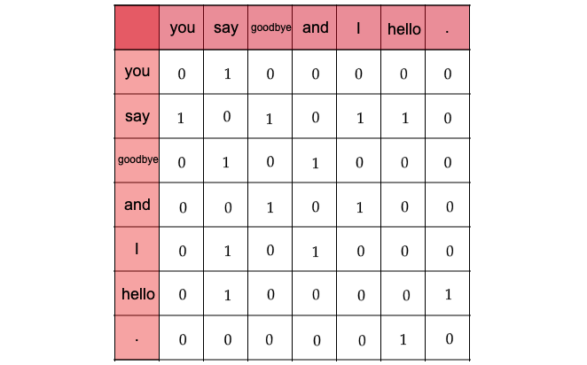
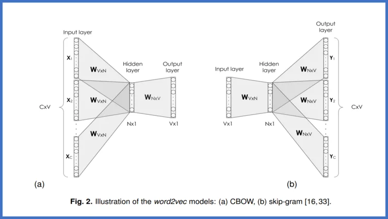
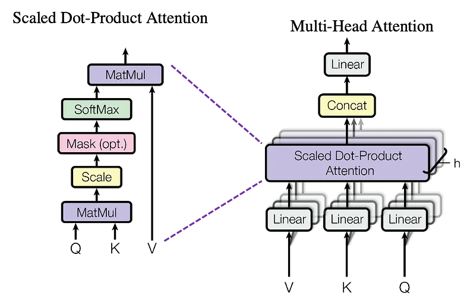
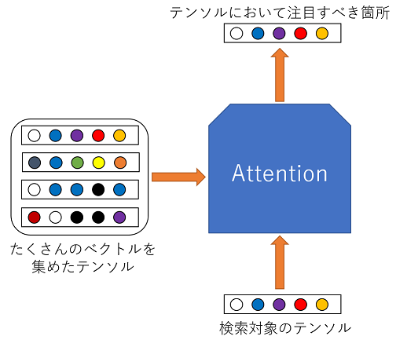
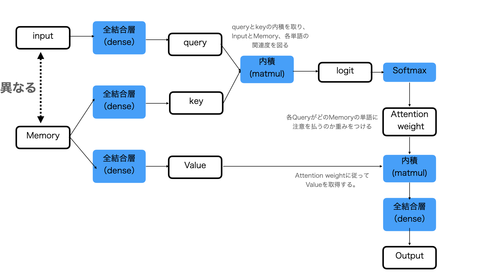
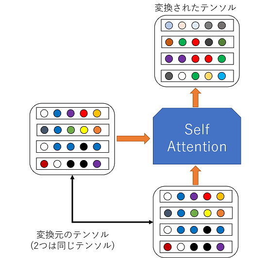
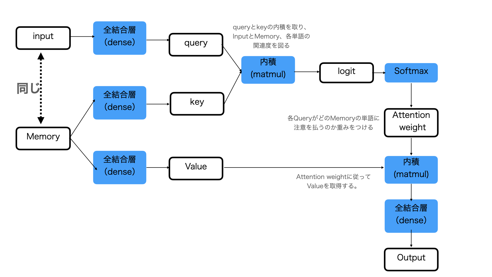

+++
title = '【読書記録】ゼロから作るDeep Learning 2 自然言語処理偏'
subtitle = ""
date = 2024-02-26
lastmod = 2024-03-02
draft = false
KaTex = true
author = "Tuuutti"
authorLink = ""
description = ""
license = "MIT"
images = []
tags = ["Deep Learning", "NLP", "自然言語処理"]
categories = ["Deep Learning"]
featuredImage = ""
featuredImagePreview = ""
isCJKLanguage = true
hiddenFromHomePage = false
hiddenFromSearch = false
twemoji = false
lightgallery = true
ruby = true
fraction = true
fontawesome = true
linkToMarkdown = true
rssFullText = false
+++

<!--more-->

# 書籍関連リンク
- [ゼロから作るDeep Learning 2 ―自然言語処理編](https://www.oreilly.co.jp/books/9784873118369/)
- [GitHubリポジトリ](https://github.com/oreilly-japan/deep-learning-from-scratch-2)

# まとめ
## カウントベースの手法の流れ
1. 共起行列の作成 (単語同士の出現頻度の関係性を行列表記)
2. PMI行列への変換 (頻度から確率を用いて行列を変換)
3. 特異値分解による密行列化 (疎行列から密行列への変換)

### 単語の分散表現（Word Embedding）
- 単語を固定長の密なベクトルで表現する手法
- 単語間の意味的な関係を反映するよう設計

### 分布仮説（Distributional Hypothesis）
- 単語の意味はその周囲の単語 (コンテキスト) によって決まるという説

### 共起行列（Co-occurrence Matrix）
- 単語のペアが一緒に現れる回数を示した行列

### 相互情報量（Pointwise Mutual Information, PMI）
- 2つの事象が同時に起こる確率がそれぞれの事象が独立して起こる確率に対してどれだけ上回るかを示す尺度
- 以下の式で計算される
$$PMI(x, y) = \log \left( \frac{P(x, y)}{P(x) \cdot P(y)} \right)$$
- コーパスに含まれる単語の語彙数が増えると疎行列となるため、ノイズの影響を受けやすくなる
→ 次元削減による密行列への変換を実施

### 特異値分解（Singular Value Decomposition, SVD）
- 次元削減手法の1つ
- 以下の式で計算され、ある行列を2つの直行行列と対角行列（対角成分が特異値）の行列積として分解する
$$A = UΣV^T$$
- np.linalg.svd()は全ての特異値に対して計算するため処理に時間がかかる。一方、Trancated SVD (e.g. sklearn.decomposition.TruncatedSVD) は**特異値の大きいベクトルだけを計算**するため処理が早い。
- 分解後の行列 $U$ を新しい単語の分散表現として使用することで、単語の類似度をより精度よく計算できる

## 推論ベース（word2vec）の手法の流れ
1. CBOW or Skip-gram の選択
2. 各モデルに適した前処理
3. NNモデルの学習
4. 学習後の入力層もしくは出力層の重みが単語の分散表現

### word2vec
- カウントベースの手法では入力データが変わるたびに、全データで分散表現を再計算する必要があるが、推論ベースの手法では追加データのみに対して重みを再学習すればよく、分散表現の更新が効率的に行える
- 高速化の方法として、Negative Samplingがあり、これは単語の多クラス分類から正例・負例の**2値分類への変換** ＋ 学習に使用する負例を単語の出現確立に基づいて**数個だけサンプリング**により、計算速度を改善する手法

### CBOW（Continuous Bag-of-words）
- 周囲の単語（コンテキスト）から一つの単語（ターゲット）を推測

### Skip-gram
- ターゲットからコンテキストを推測

## RNNモデル
- 順序を取り扱う必要のあるデータ（時系列データや言語データ）に対するDLモデル
- RNNは前時刻に計算した結果を用いて逐次的に計算を行うため、時間方向に対する並列計算が基本的にはできないので、並列計算による高速化の実現が難しい
- 純粋なRNNモデルでは、逆伝播時に以下の問題が生じる
    - 時間方向の勾配消失 → LSTMやGRUなどのゲート付きRNNで解決
    - 時間方向の勾配爆発 → 勾配クリッピングで解決
    - 深さ方向の勾配消失 → Skip結合で解決

## 注意機構（Attention）
ある単語に対応した**情報を「選ぶ」という操作は微分不可能**であり、逆伝播によるモデルの学習が行えない。そこである単語ではなく全単語を用いて行列積（微分可能）として、**単語ごとの重要度（Attention-weight）を計算**することで、**疑似的に「選ぶ」という計算を実現**し、逆伝播による学習も行えるようにしたLayerのこと。

### 用語の意味
- クエリ（Q）：他のデータとの関連性を調べたいデータの集まり
    - Source-Target-Attentionの場合：翻訳先の言語データ
    - Self-Attentionの場合：翻訳元の言語データ
- キー（K）：入力データの埋め込みベクトル（クエリの説明に記載した他のデータのこと）
- バリュー（V）：キーで使用するデータが保持する値

### Source-Target-Attention
- **異なる入力**の関連性を計算
- 例として、Encoderに翻訳元の言語データ、Decoderに翻訳先の言語データを用いて、翻訳元の言語と翻訳先の言語の単語の関連性を学習することが挙げられる

### Self-Attention
- **同じ入力の異なる要素（たとえば、単語）同士**の関連性を計算
- 例として、文章の文法や構造、単語同士の関係性を学習することが挙げられる

# 参考情報
- [【自然言語処理】Attentionとは何か](https://omathin.com/what-is-attention-1/)
- [Self Attentionについて](https://www.taida-information.com/?p=403)