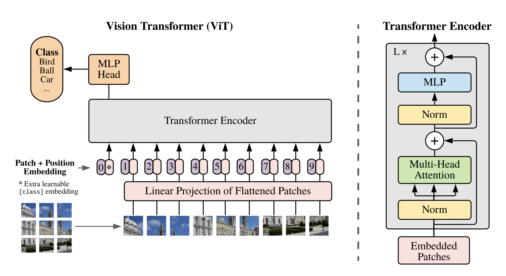
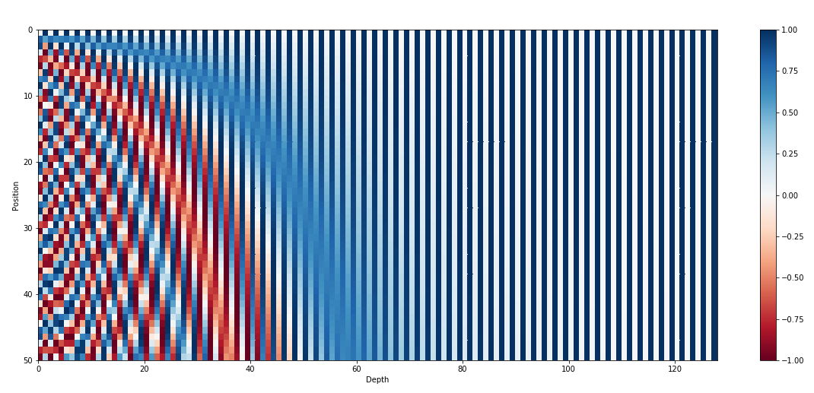
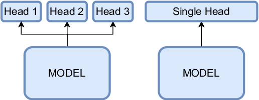
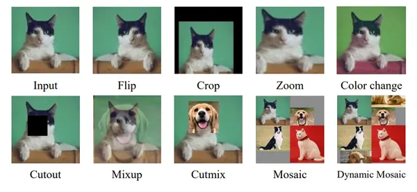
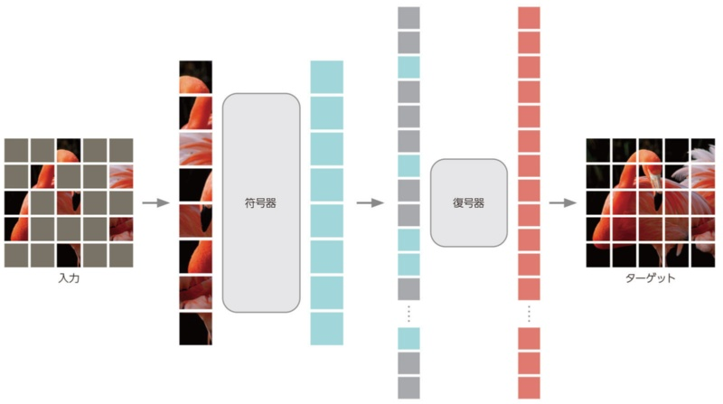
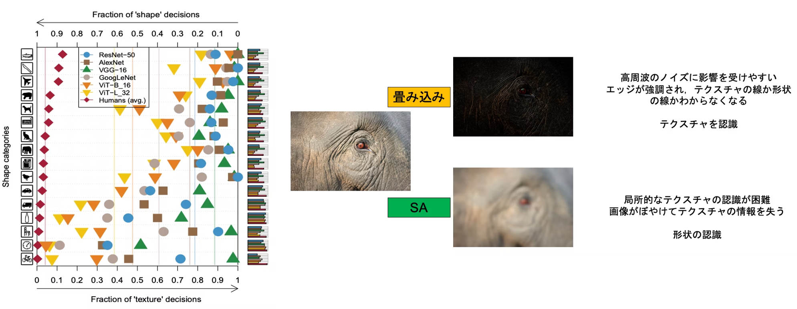
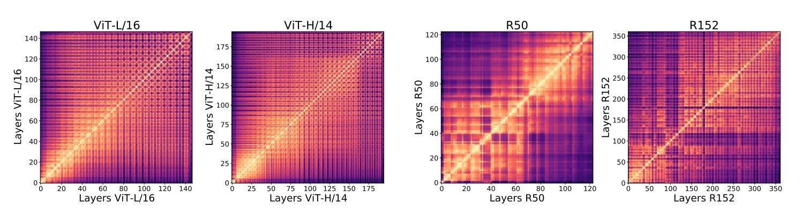
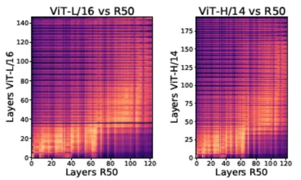

+++
title = '【読書記録】Vision Transformer入門'
subtitle = ""
date = 2024-03-06
lastmod = 2024-03-10
draft = false
KaTex = true
author = "Tuuutti"
authorLink = ""
description = ""
license = "MIT"
images = []
tags = ["Deep Learning", "画像認識"]
categories = ["Deep Learning"]
featuredImage = ""
featuredImagePreview = ""
isCJKLanguage = true
hiddenFromHomePage = false
hiddenFromSearch = false
twemoji = false
lightgallery = true
ruby = true
fraction = true
fontawesome = true
linkToMarkdown = true
rssFullText = false
+++

<!--more-->

# 書籍関連リンク
- [Vision Transformer入門](https://gihyo.jp/book/2022/978-4-297-13058-9)
- [GitHubリポジトリ](https://github.com/ghmagazine/vit_book)

# まとめ
## ViTの構成

- Vitは以下の3つの部分からなる
    1. Input Layer
    2. Encoder
    3. MLP Head
- Input Layer
    - 入力：Patchに分割した画像
    - 出力：クラストークンおよび各パッチに対応するベクトル
- Encoder
    - 入力：クラストークンおよび各パッチに対応するベクトル
    - 出力：クラストークン
- MLP Head
    - 入力：クラストークン
    - 出力：各クラスの確率 (多クラス分類)

## Input Layer
- 入力画像に対して、以下の4つの処理を実施
    1. **パッチ分割**：画像をN分割し、分割後のN枚の画像をそれぞれ3階のテンソル (高さ、幅、チャネル) から1次元のベクトルに変換 (flatten)。
    2. **埋め込み**：分割後の1次元ベクトルに対して、1層の全結合層で埋め込み。
    3. **クラストークン付与**：2で作成した埋め込みベクトルと同一長さのベクトルを、標準正規分布に従った乱数を用いて初期値を生成。学習により値を更新。
    4. **位置埋め込み**：各パッチの位置情報をクラストークンおよびパッチの埋め込みベクトルに対して付与 (加算)。クラストークン同様、位置埋め込みも学習可能なパラメータ。

## Encoder
- Input Layerから出力を入力ベクトルとして、以下の3つの層を適用。Encoder Blockが複数層組まれている。
    1. **Layer Normalization**：トークン数の異なるデータも正規化可能
    2. **Multi-Head Attention**：パッチの埋め込みベクトルをHeadの数だけ分割し、分割後のベクトルごとにAttention-weightと出力を計算。出力を再度結合して、元のデータの次元と合わせる。
    3. **Multi Layer Perceptron**：2層の全結合層からなる。

## MLP Head
- Encoderからの出力を入力ベクトルとして、Layer Normalizationと全結合層から最終的なクラスに所属する確率を計算。MLP Headの出力ベクトルの長さはクラス数と同一。

## 位置埋め込み (Positional Embedding)
- 位置情報を明示的に考慮できないSelf-attentionにトークン位置情報を付加
- 位置埋め込みの作り方と活用で工夫が行われている
    - 位置埋め込み：学習必要 or 学習不要
    - 活用方法：絶対位置 or 相対位置
- 学習不要な位置埋め込みの例として、`Sinusoidal Positional Encoding` がある
$$P_{(t,2i)} = \sin\left(\frac{1}{10000^{2i/d_{\text{model}}}} \cdot t \right) \quad P_{(t,2i+1)} = \cos\left(\frac{t}{10000^{2i/d_{\text{model}}}} \cdot t \right)$$
$t$：トークン位置
$i$：位置埋め込みの次元数を決めるパラメータ ($2i$次元のベクトル)

上図では $t$ をy軸、$i$ をx軸として、位置埋め込みの値を示している。本式で $t$ はトークン位置として定義しているが、周期関数の時間としてみなすと、$\frac{1}{10000^{2i/d_{\text{model}}}}$ は周波数に相当する。すなわち $i$ が小さいほど周波数は大きくなる。そのためDepthが小さい左側では、Positionの変化に対して早い周期で値が変化する。一方、$i$ が大きい右側では周期が遅いため、ほとんど値が変化しないということがわかる。

## Multi-Head Attention
トークン埋め込みをチャネル方向に均等に分割して次元の小さい複数のベクトルとし、それぞれでクエリとキーの内積計算を実施。内積の大きい成分に注意機構が働くため、通常のSelf Attention (つまりSingle-Head Attention) では注意機構の多様性を確保するのが蒸すかしいが、Multi-Headにすることで、各Headで内積計算を実行するため、Headごとに注意機構を学習でき、モデルの多様性の向上につながる。

しかしながら、いくつかの研究では学習済みのTransformerのMulti-Head Attentionの大部分のHeadを刈り込んでも、大きな性能低下が生じないと報告している。つまり、複数のHeadが同じような特徴を参照している、もしくは重要でない特徴を学習しているということを示唆している。そこで各Headに別々の役割を持たせ、多様性に富んだモデルにするためのテクニックが研究されている。

### Disagreement Regularization
損失関数に多様性を向上させる項を追加

### Multi-Head Attention with diversity
各Head間の類似度が所望のマージンよりも遠くなるように学習を行う手法

### Rectified Linear Attention
Attention計算時にSoftMax関数をReLuに置き換えることでAttentionをスパース化し、多様性の向上を図る手法

## データ拡張の種類

## MAE (Masked AutoEncoder)
ViTを用いたEncoder-Decoderモデルで、Encoderではパッチに分割された入力画像の一部のパッチをランダムにマスキングし、マスクされていないパッチのみを入力。一方、Decoderではエンコードされたパッチトークンとマスクトークンを入力。全てのマスクトークンは共通で、マスクされた位置に対応。マスクされたパッチについてはPositional Embeddingを加えて、一連のTransformerのブロックへと入力。

## ViTとCNNの比較
1. **ViTは形状**を頼りに物体を識別、**CNNはテクスチャ**を頼りに物体を識別

2. **CKA (Centered Kernel Alignment) 類似度**という活性化関数への入力ベクトルの類似度を表す指標から、ViTは全総に渡って類似性が認められるのに対し、ResNet (CNN) は小規模だと近い層同士で類似、大規模化するとViTに似た大域的な類似性を示す

3. ViTとResNetで入力側に近い層でCKA類似度が高く、局所特徴に反応する

4. 層の途中まででネットワークを切り出し、出力側に線形層を結合してFew-Shotトレーニングを行ったところ、ViTはResNetに比べ高精度であったことから、ResNetは大域的な特徴を出力に近い層で抽出していると示唆されている

## 帰納バイアス
モデルやアルゴリズムが有する制約。例えばCNNの場合、局所特徴を段階的に集約するという帰納バイアスがある。

## 知識の蒸留：小規模データでのViTの学習方法 
知識の蒸留とは、学習済みのネットワーク (教師) の出力分布を目標として、未学習のネットワーク (生徒) の学習に利用する方法。例えば学習済みのCNNを教師として、ViTを小規模データで学習するというような活用法。

# 参考情報
- [【論文5分まとめ】Masked Autoencoders Are Scalable Vision Learners](https://zenn.dev/takoroy/articles/98400e156576df)