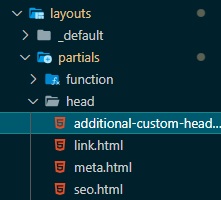
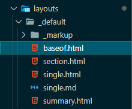
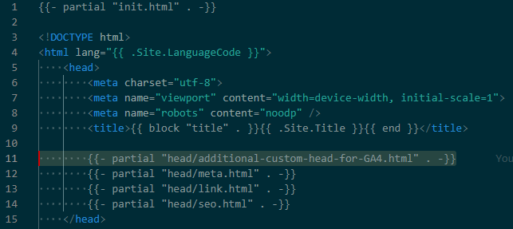

+++
title = 'HugoのLoveItテーマでGoogle Analytics 4を適用する方法'
subtitle = ""
date = 2024-01-10
lastmod = 2024-01-13
draft = false
author = "Tuuutti"
authorLink = ""
description = ""
license = "MIT"
images = []
tags = ["Hugo", "LoveIt", "Google Analytics 4", "GA4"]
categories = ["Hugo"]
featuredImage = ""
featuredImagePreview = ""
isCJKLanguage = true
hiddenFromHomePage = false
hiddenFromSearch = false
twemoji = false
lightgallery = true
ruby = true
fraction = true
fontawesome = true
linkToMarkdown = true
rssFullText = false
+++

<!--more-->

> ※ hugo.tomlに以下設定項目があるが、これは `Universal Analytics` のidに対応しており、 `Google Analytics 4 (GA4)` では、別途設定が必要である。
> ```
> [params.analytics.google]
> id = ""
>```

### 手順
1. GA4のGoogleタグを取得
    - Google Analyticsの登録手順は、他サイトを参考にする。
    - Googleタグの確認方法は、[サポートページ](https://support.google.com/analytics/topic/12208141?hl=ja&ref_topic=12154439)の `Google タグ（gtag.js）` セクションを参照する。
    ```
    <!-- Google タグ（gtag.js） -->
    <script async src="https://www.googletagmanager.com/gtag/js?id=Measurement-ID"></script>
    <script>
    window.dataLayer = window.dataLayer || [];
    function gtag(){dataLayer.push(arguments);}
    gtag('js', new Date());

    gtag('config', 'Measurement-ID');
    </script>
    ```
<br>

2. Googleタグをhtmlファイルとして、`layouts/partials/head/{htmlファイル名}`の階層に保存
    
<br>

3. 2で作成したファイルを読み込むために `layouts/_default/baseof.html` を修正
    - baseof.htmlファイルにスクリプト追記する場所は、`<head>`タグ内であれはどこでもよい
    
    

### 参考情報
- [HugoのGoogle AnalyticsをGA4対応](https://scribble.washo3.com/hugo-analytics-ga4)