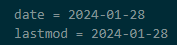

+++
title = 'Hugoで未来の記事もビルドする方法'
subtitle = ""
date = 2024-01-28
lastmod = 2024-01-28
draft = true
author = "Tuuutti"
authorLink = ""
description = ""
license = "MIT"
images = []
tags = ["Hugo"]
categories = ["Hugo"]
featuredImage = ""
featuredImagePreview = ""
isCJKLanguage = true
hiddenFromHomePage = false
hiddenFromSearch = false
twemoji = false
lightgallery = true
ruby = true
fraction = true
fontawesome = true
linkToMarkdown = true
rssFullText = false
+++

<!--more-->

### 現象
1. 自分は記事を管理する際に、記事更新時の更新時刻の変更が面倒なので、日付のみを管理している

2. 当日 (2024/01/28) ビルドするとビルドは完了するものの、当日作成した記事のみ表示されない

3. 試しに前日の日付 (2024/01/27) を設定すると、ビルドされて記事を確認できた

4. 日時設定から時刻を削除し日付のみにすると、その日に作成した記事はビルド出来ないことが判明
 

### 対策
以下2つの対策が考えられる
1. ビルドする際に `--buildFuture` or `-F` のフラグをコマンドに追加することで、未来の日付の記事もビルド
2. 時刻もめんどくさがらず、きちんと更新する
~~lastmodを設定しなければ、そもそも時刻を管理する必要はなくなるが、個人的に更新した日付は管理したい~~

### 参考情報
- [未来の投稿記事もビルドする](https://www.bnote.net/hugo/build_option.html)