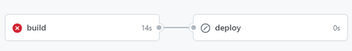
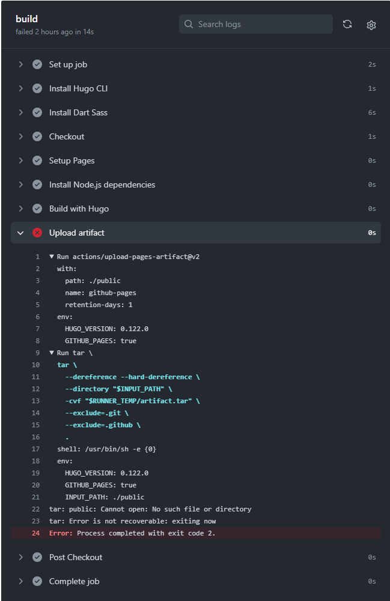

+++
title = '5分で出来る！Hugoで作成したブログをCI/CDで自動デプロイ'
subtitle = ""
date = 2024-02-03
lastmod = 2024-02-03
draft = false
author = "Tuuutti"
authorLink = ""
description = ""
license = "MIT"
images = []
tags = ["Hugo", "CI/CD", "GitHub Actions"]
categories = ["CI/CD"]
featuredImage = ""
featuredImagePreview = ""
isCJKLanguage = true
hiddenFromHomePage = false
hiddenFromSearch = false
twemoji = false
lightgallery = true
ruby = true
fraction = true
fontawesome = true
linkToMarkdown = true
rssFullText = false
+++

<!--more-->

### 手順
1. GitHubのリポジトリの Settings > Pages で `Build and deployment` の Source をGitHub Actions に変更
2. Hugoのルートディレクトリで `.github/workflows/hugo.yaml` を作成
3. 以下内容を2で作成したファイルにコピー

```yaml
# Sample workflow for building and deploying a Hugo site to GitHub Pages
name: Deploy Hugo site to Pages

on:
# Runs on pushes targeting the default branch
push:
    branches:
    - main

# Allows you to run this workflow manually from the Actions tab
workflow_dispatch:

# Sets permissions of the GITHUB_TOKEN to allow deployment to GitHub Pages
permissions:
contents: read
pages: write
id-token: write

# Allow only one concurrent deployment, skipping runs queued between the run in-progress and latest queued.
# However, do NOT cancel in-progress runs as we want to allow these production deployments to complete.
concurrency:
group: "pages"
cancel-in-progress: false

# Default to bash
defaults:
run:
    shell: bash

jobs:
# Build job
build:
    runs-on: ubuntu-latest
    env:
    HUGO_VERSION: 0.122.0
    steps:
    - name: Install Hugo CLI
        run: |
        wget -O ${{ runner.temp }}/hugo.deb https://github.com/gohugoio/hugo/releases/download/v${HUGO_VERSION}/hugo_extended_${HUGO_VERSION}_linux-amd64.deb \
        && sudo dpkg -i ${{ runner.temp }}/hugo.deb          
    - name: Install Dart Sass
        run: sudo snap install dart-sass
    - name: Checkout
        uses: actions/checkout@v4
        with:
        submodules: recursive
        fetch-depth: 0
    - name: Setup Pages
        id: pages
        uses: actions/configure-pages@v4
    - name: Install Node.js dependencies
        run: "[[ -f package-lock.json || -f npm-shrinkwrap.json ]] && npm ci || true"
    - name: Build with Hugo
        env:
        # For maximum backward compatibility with Hugo modules
        HUGO_ENVIRONMENT: production
        HUGO_ENV: production
        run: |
        hugo \
            --gc \
            --minify \
            --baseURL "${{ steps.pages.outputs.base_url }}/"          
    - name: Upload artifact
        uses: actions/upload-pages-artifact@v2
        with:
        path: ./public

# Deployment job
deploy:
    environment:
    name: github-pages
    url: ${{ steps.deployment.outputs.page_url }}
    runs-on: ubuntu-latest
    needs: build
    steps:
    - name: Deploy to GitHub Pages
        id: deployment
        uses: actions/deploy-pages@v3
```

4. GitHubに Commit & Push
5. GitHubのActionsタブで、Build & Deploy の Status を確認
6. CI/CDが成功していれば、以下のようにそれぞれチェックマークが表示される
    - 成功例
    
    <br>
    - 失敗例
    
    失敗した場合は、どこで失敗しているかを確認
    → buildをクリックし、エラー発生箇所を特定
    → 以下の例では、`path` が `./public` に設定されているが、`hugo.toml` にて `publishDir = "docs"` と指定していたために生じたエラー
    
<br>

### 参考情報
- [Host on GitHub Pages](https://gohugo.io/hosting-and-deployment/hosting-on-github/)