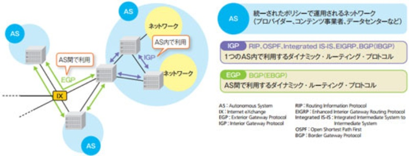

+++
title = '【読書記録】ネットワークがよくわかる教科書'
subtitle = ""
date = 2024-03-17
lastmod = 2024-03-20
draft = false
KaTex = false
author = "Tuuutti"
authorLink = ""
description = ""
license = "MIT"
images = []
tags = ["Infra", "Network"]
categories = ["Infra"]
featuredImage = ""
featuredImagePreview = ""
isCJKLanguage = true
hiddenFromHomePage = false
hiddenFromSearch = false
twemoji = false
lightgallery = true
ruby = true
fraction = true
fontawesome = true
linkToMarkdown = true
rssFullText = false
+++

<!--more-->

## アドレスの種類
- 物理アドレス (MACアドレス)：ハードウェア (具体的にはNIC) に付与されるアドレス (ipconfig /allコマンドで確認可能)
→ 直接繋がってるイーサネット内の機器を識別するためのアドレス
- 論理アドレス (IPアドレス)：ハードウェアとは無関係に付与されるアドレス

## ネットワークを構成するデバイス
- L2スイッチ：1つのネットワークを構成するために使用する有線LAN用の接続ボックス
- ルータ：L2スイッチで構成したネットワーク同士を接続する機器
- L3スイッチ：L2スイッチとルータを1つに合わせたような機器
- Wi-Fiルータ：Wi-Fiアクセスポイント、ルータ、スイッチなどの機能をコンパクトにまとめた機器

## プロトコルの階層化
- OSI参照モデル
- TCP/IP 4階層モデル

## インターネット層の主なプロトコル
- IP：直接繋がっていないネットワーク間で、パケットをルーティングする機能を提供するプロトコル
- ICMP：任意の相手に到達できるかの検査や到達できない場合の理由通知などを行うための補助プロトコル (pingコマンドはICMPの機能を活用)

### IPアドレス (ネットワークの住所)
- 通信相手を特定するための32bitの識別子
- ネットマスクによりネットワーク部とホスト部が定められ、規模や用途に応じてクラス分けがなされている
    - クラスA：大規模ネットワーク向け (ホスト部が24bit)
    - クラスB：中規模ネットワーク向け (ホスト部が16bit)
    - クラスC：小規模ネットワーク向け (ホスト部が8bit)
- ネットワークアドレス：ホスト部のbitがすべて0として定義される、ネットワーク自身のアドレス
- ブロードキャストアドレス：ホスト部のbitがすべて1として定義される、あるネットワークに所属するすべての機器に通信を行うためのアドレス
- サブネット化：IPアドレス中のホスト部の一部をネットワーク部として利用すること
→ 例えばネットワーク部を2bit分増やした場合、(00, 01, 10, 11)の4組分のサブネットに分割が可能
- 可変長サブネットマスク：サブネット化時に、各サブネットで用いるサブネットマスクの長さを可変にする技術
- CIDR表記：IPアドレスとサブネットマスクを同時に記載
→ 192.168.1.65/26の場合、26bitがネットワーク部ということを示している
- IPv6では、ネットワーク部はネットワークプレフィックス、ホスト部はインターフェースIDという呼称で、それぞれ64bitの識別子で表される
- ルーティングとは、異なるイーサネット (物理層とデータリンク層) 間のパケットを、IP (ネットワーク層) の機能によって中継すること。イーサネット同士をハブで接続して、物理層とデータリンク層でネットワークを拡張するのとは異なる。

## トランスポート層の主なプロトコル
- TCP：コネクション指向型で、信頼性の高い通信を実現するためのプロトコル (netstatコマンドでTCPの接続状態を確認可能)
- UDP：コネクションレス型で、リアルタイム性の高い通信を実現するためのプロトコル

### ポート番号 (ネットワークの宛先)
- TCP/IPを用いて接続待ちをするプログラムが接続を受け付けるポートの番号
- ポート番号の情報はTCPパケットやUDPパケットのポート番号フィールドに格納され、接続先に送信される

## ARP
- 相手コンピュータのIPアドレスからMACアドレスを取得
    1. ネットワーク内の全コンピュータに探索しているIPアドレスの情報をブロードキャスト (ARPリクエスト)
    2. ARPリクエストを受け取った各コンピュータは、IPアドレスが自身のIPアドレスと一致するか確認
    3. 一致する場合、ARPリクエストの送信元に対して応答を返送 (ARPリプライ)
    4. IPアドレスとMACアドレスの対応付けが行われる (対応関係は一定時間ARPキャッシュに保存される、arp -aコマンドでARPキャッシュを確認可能)

## デフォルトゲートウェイ
- ルーティングテーブルに記載のない宛先の場合に転送する転送先のルータのこと
- ルーティングテーブルは、netstat -rコマンドで確認可能

## MTU (Maximum Transmission Unit)
- ネットワークハードウェアが一度に送信できる最大データサイズ
- MTUを超えるデータサイズの通信を行う場合は、IPフラグメンテーションが発生
- IPフラグメンテーションが発生した場合、分割されたIPパケットは、それぞれ独立にルーティングされるため、受信側は必ずしも送信順通りにデータを受け取るとは限らない
- もし分割されたパケットの一部が届かない場合は、再構築できないデータとして、分割前のIPパケット全体が破棄される
- ルータでのIPフラグメンテーションを回避する策としてPath MTU Discoveryがあり、これはネットワーク上で最小のMTUに合わせてパケットを組み立てる手法

## 光ファイバの種類
- マルチモードファイバ
    - 芯線が太く、ケーブルの取り回しが楽
    - 伝搬モードごとに反射回数が違うため、光の到着時間が異なり、波形がひずみやすい
    - 伝送損失が大きく、長距離伝送には向かない
- シングルモードファイバ
    - 単一の伝搬モードのため、原理上は到着時間差がなく、波形がひずまない
    - 伝送損失が小さく、長距離伝送には適している
    - 芯線が細く、ケーブルの取り回しが面倒

## スイッチングハブ (スイッチ、ハブ)
- 受信したデータの宛先を能動的にチェックし、宛先に指定された端末が繋がっているポートを選んで、選択的にデータを送り出すハブ
- スイッチングハブの動作
    1. 送信元コンピュータのNICが送出したイーサネットフレームを受信
    2. 受信したフレームの宛先を分析 (転送データベースにMACアドレスが登録されているかを確認)
    → ネットワークに接続したばかりなどの理由で転送データベースにMACアドレスが登録されていない場合は、送信元のポートを除いたすべてのポートにフレームを転送 (フラッディング)
    3. 宛先コンピュータが繋がっているポートにフレームを転送
    4. 宛先コンピュータのNICに対して送出
- ノンブロッキング：スイッチング容量 (転送コンポーネントが1秒間に転送できるデータ量) とパケット転送能力 (1秒間に処理できるパケット数) を十分に満足していて、ハブやスイッチを挟んでいてもケーブルだけの状態と変わらない通信速度が得られること
- スイッチングハブはハブと端末の通信を全二重 (送信と受信を同時に行う通信方式) で行う

## ネットワークの冗長化
- ブロードキャストストーム：ブロードキャストが際限なく転送され続けることによって起こるネットワーク障害

### プロトコルによる冗長化
- STP（Spanning Tree Protocol）：データトラフィックが永続的に流れ続けることを防止するプロトコル

- VRRP（Virtual Router Redundancy Protocol）：複数のルータ間で仮想的なルータを構成し、高可用性を提供するプロトコル

### プロトコルによる冗長化の問題点と解決策
- 問題点：設定が複雑、障害発生時の切り替わりに時間を要する
- 解決策：以下2つの技術の活用
    - スイッチのスタッキング：複数の物理スイッチを論理的に1台のスイッチとして動作させる技術
    - リンクアグリゲーション：複数の物理回線を1つの論理リンクとして扱い、帯域幅を拡大するとともに、リンクの冗長性を高める技術

## ISPのネットワーク接続方法
- トランジット：より小規模のISPが大規模なネットワークを持つISPに料金を支払い、ネットワークを使用
- ピアリング：同等のネットワーク規模を持つISPが無償でお互いのトラフィックを交換
    - パブリックピアリング：IX事業者によって提供されるスイッチ上で行われる接続
    - プライベートピアリング：IXを介さずにISP同士が直接専用線などを用いて接続

### ISPと回線事業者の関係
- アクセス回線（光回線）：アクセス回線事業者のネットワークと利用拠点を中継
- ISP（プロバイダ）：アクセス回線を介してやり取りする情報をインターネットへ中継

## PPPoEとIPoEの比較
- PPPoE：アクセス回線とISPとのゲートウェイで網終端装置による認証を行う必要があるため、通信量が増加すると輻輳が発生
- IPoE：網終端装置を使用せず直接インターネットへ接続するので、通信速度は速く安定

## NAT/NAPT
- NAT：IPアドレスを他のIPアドレスに1:1対応で変換する技術。
- NAPT：1つのグローバルIPアドレスを複数の端末で共有するために、TCP（UDP）/IPパケットに含まれるIPアドレスとポート番号を、別のIPアドレスとポート番号として、1:nに変換する技術。IPマスカレードとも呼ぶ。

## ドメイン名とDNS

## メール受信方式の違い

## 通信状態の確認を行うコマンド (Windows)
- IP到達性：ping <IPアドレス or ドメイン名>
- DNS名前解決：nslookup <ドメイン名>
- ルーティング：tracert <IPアドレス or ドメイン名>
    - 調査対象のIPもしくはドメインに至るまでにたどるルータを、クライアントに近い順で表示していく (≒最終表示が調査対象)
    - ルータ管理者がセキュリティなどの理由で、応答を返さないように設定されているルータの場合は、* が表示される

## ルーティングプロトコル
- AS（Autonomous System）：同一の経路制御ポリシーを共有するネットワーク
- IGP（Interior Gateway Protocol）：同じネットワーク（AS）内にある機器同士で情報交換をする際に使用されるルーティング・プロトコル（RIP、OSPF、IGRP/EIGRP、IS-IS）
- EGP（Exterior Gateway Protocol）：別のネットワーク（AS）にある機器同士で情報交換をする際に使用されるルーティング・プロトコル（BGP）

## UTM（Unified Threat Management）
- コンピュータウイルスや不正アクセスなどの脅威に備えて複数のセキュリティ機能を一つの機器で運用管理し、包括的に社内ネットワークを保護する手法や製品のこと

## 暗号化
- 共通鍵暗号方式
    - メリット
        - 計算処理が速い
        - ファイルやデータの暗号化にかかる処理速度が早い
        - 簡単な暗号アルゴリズムを用いるため、データの暗号化と復号化の処理速度が早い
    - デメリット
        - 鍵の配送問題があり、鍵の安全な伝達が必要であること
        - 通信相手が増えると管理する鍵の数が増えること
        - 送信した鍵が第三者に盗まれる危険がある
- 公開鍵暗号方式
    - メリット
        - データの安全性が高い
        - 管理がしやすい
        - なりすましや盗聴などの脅威への対策となる
    - デメリット
        - 暗号化や復号化の処理時間が長くなる
        - PCへの負担が大きくなりやすい
        - 大きな情報のやり取りには向いていない

### SSL/TLS
ハイブリッド暗号方式を用いて、サーバクライアント間の通信を暗号化する技術

## VPN
ネットワークの中にプライベートなネットワークを作り出す技術で、以下2つの技術が用いられる
- トンネリング：あるネットワークから別のネットワークにパケットを移動させるための仮想的な通信路を作る技術。トンネリングを行うためには、パケットのカプセル化が必要。
- カプセル化：パケットの暗号化と宛先VPNルータのグローバルIPヘッダーの付与を行う。

## 無線通信
### 周波数帯ごとの特性

### 使用帯域と帯域幅 (チャネル幅)
- 2.4GHz帯
    - 5MHz間隔で13チャネル存在
    - 各チャネルは22MHzの帯域を使用
    - 同時に使用できるチャネルに制限あり
    
- 5GHz帯
    - 20MHz間隔で19チャネル存在
    - 各チャネルは20MHzの帯域を使用
    - 同時に使用できるチャネルに制限なし
    

### チャネルボンディング
- 802.11n規格から使われるようになった帰納
- 複数のチャネルを束ねて一つの通信に使うことで、スループットを向上させる技術
- 帯域幅が広いほど、複数周波数の電波を一度に送信できるため、単位時間当たりの情報伝達量が増加
- チャネルボンディング数
    - 802.11n：2チャネル分
    - 802.11ac：4, 8, 16チャネル分

### SSIDと線LANの規格
- A：5GHz帯 (802.11aに由来)
- G：2.4GHz帯 (802.11gに由来)

### 無線通信高速化
- MIMO（Multiple Input Multiple Output）：送受信側が複数のアンテナを使って通信する技術
- MU-MIMO（Multi-User MIMO）：複数の送受信者が同時に通信する技術
    - ビームフォーミング (Wi-Fiルーターが端末の位置や距離を把握し、送信タイミングを調整して、電波の到達距離や速度を向上させる技術) を使い、電波干渉が起きないよう複数の端末に向け、位相をずらしてデータを送信するため、空間多重な通信を実現し、速度低下が起こりにくい
    - Wi-Fi 5では下りのみ利用できたが、Wi-Fi 6からダウンロードだけでなくアップロードでも活用できるようになった (ただし受信側もWi-Fi 6に対応したデバイスである必要がある)
