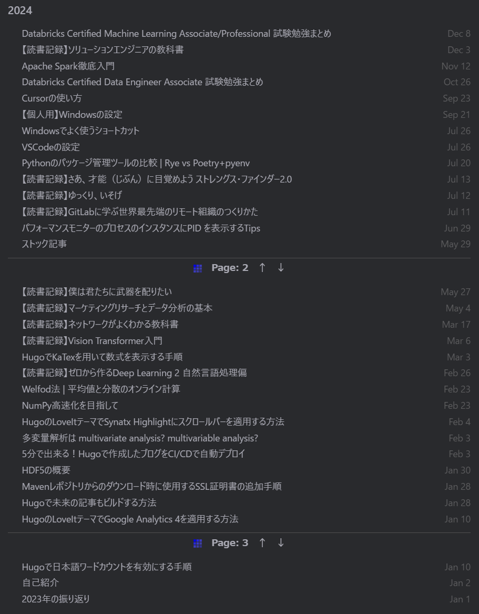

+++
title = '2024年の振り返り'
subtitle = ""
date = 2025-01-03
lastmod = 2025-01-03
draft = false
author = "Tuuutti"
authorLink = ""
description = ""
license = "MIT"
images = []
tags = ["振り返り"]
categories = ["語り"]
featuredImage = ""
featuredImagePreview = ""
isCJKLanguage = true
hiddenFromHomePage = false
hiddenFromSearch = false
twemoji = false
lightgallery = true
ruby = true
fraction = true
fontawesome = true
linkToMarkdown = true
rssFullText = false
+++

<!--more-->

## 2024年のハイライト
### 転職
2024年の一大イベントだった。自身のキャリアや理想の生活を考えた際に、前職よりも適切な場所があるのではと思い転職活動を開始し、最終的に現職に決めた。転職軸は大きく3つあった。1つ目が他のドメインや様々な技術を扱いたい、2つ目がクラウド環境の使用経験を手に入れたい、3つ目が勤務地が関東もしくは関西。他にも年収アップや英語環境などもWant条件として考えてはいたが、上記3つを最優先事項として選択した。新卒採用と異なり、中途採用は募集ポジションや入社後の担当職務が明確なので、理想のキャリア像がある人にとっては良い機会になるなと身をもって感じた。同時に中途採用は基本的に即戦力が求められるため、新卒での経験の重要性も把握できた。
 

### スキルアップ
転職軸に記載した通り、今回の転職の大部分はスキルアップが目的であった。現職に入社して4か月だが、様々な経験を積むことができている。
- ViTファインチューニングによるがん細胞検知モデルの開発
- SNS上の顧客メッセージを用いた検索・分析システムの開発
- 製品のデモ・ハンズオン資料の作成とプリセールス・ハンズオンの実施
- DatabricksとDataikuの資格取得
  - Dataiku：全資格取得
  - Databricks：Data Engineer Associate取得（2025年は Machine Learning Associate / Machine Learning Professional / Associate Developer for Apache Spark / Generative AI Engineer Associate を取得したい）
 

### 技術領域の拡大
転職後の担当プロジェクトで必要となる技術のキャッチアップを行った。
- Deep Learning

    がん細胞検知モデルの開発でViTを使用しているため、Hugging faceやPyTorchのライブラリを活用したデータセットの作成およびモデル開発の流れを公式ドキュメントで勉強した。実装自体はドキュメントを参考に行えばそこまで難しくはないが、精度を高めていくためにまだまだ工夫の余地があるので、引き続きDeep Learningの応用に関するキャッチアップと実務適用を行っていきたい。

- NLP・LLM

    顧客メッセージの検索・分析システムの開発で全文検索・ハイブリッド検索・要約の技術を使用しているため、それらに関する知見が得られた。AWS Open Search Serviceを活用した検索システムの実装とDatabricksのFoundationモデルを活用した要約機能の評価を行った。チャンキング・エンベディング・リランキングなど、LLMを活用するうえで重要となる概念を実装を通して学ぶことができた。また要約結果の評価方法として、ROUGEとLLM-as-a-judgeを適用し、感覚的になりがちなLLMの出力結果を定量的に評価するようにした。

- MLflow

    がん細胞検知モデルの開発はDatabricks上で行っており、実験管理を行うためにMLflowを活用している。各モデルの開発に使用したデータセット・画像処理・パラメータをトラッキング出来るようなパイプラインを作成し、モデル開発の透明性や再現性を可能な限り高く保つように工夫している。

- プロダクト

    以下のサービス・技術を扱った
  - AWS
    - IAM / S3 / VPC / Open Search / Cost Explorer
  - Databricks
    - Cluster / Unity Catalog / Job / Models / Serving / Experiment / Vector Search / Foundation Model
  - Dataiku
    - Recipe / Analyze / Job / Chart / Statistics / Scenario / Wiki / Dashboard / AutoML / Webapp / Dataiku Solutions / Dataiku Gallery
 

### ブログでのアウトプット
[ブログ](https://tutti-hobbyist.github.io/hugo_blog/)でのアウトプットを継続した。2024年は大小合わせて全部で32記事を書いた。内容は本ブログで使用しているSSGのHugoについてや、前職で身に着けた知識、読書記録、試験勉強のまとめなど色々書き記した。本ブログは基本的には自分用のメモであったり、勉強した記録を残すために使用しているため、誰かの役に立つような内容は少ないかもしれないが、もし参考になる情報を少しでも提供できていたら嬉しく感じる。

 
