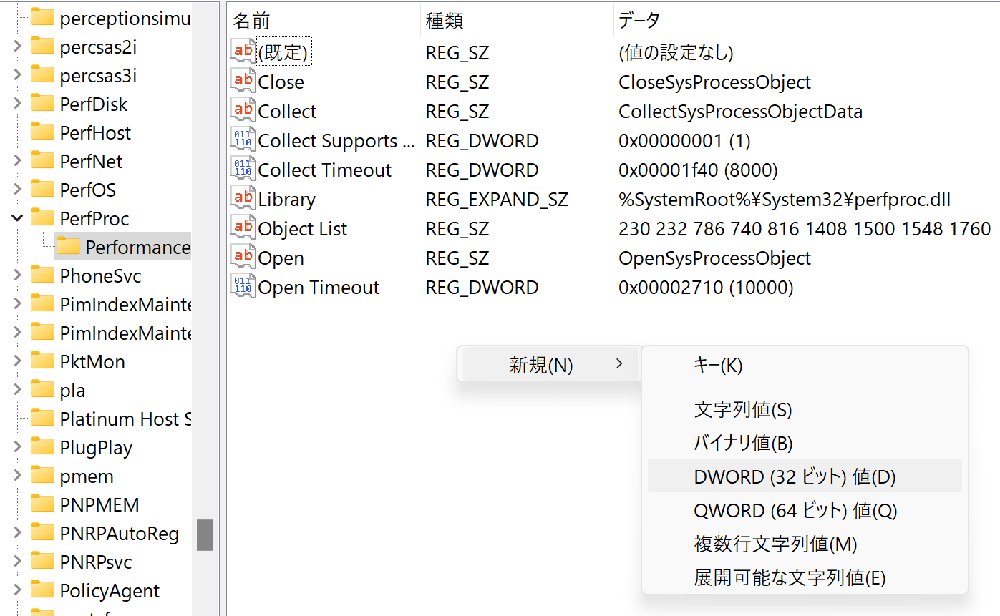
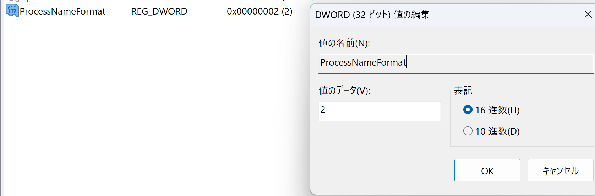
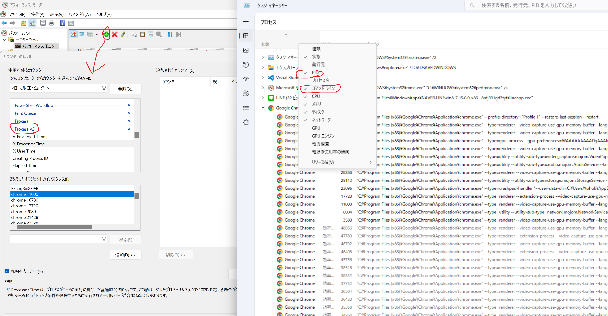

+++
title = 'パフォーマンスモニターのプロセスのインスタンスにPID を表示するTips'
subtitle = ""
date = 2024-06-29
lastmod = 2024-06-29
draft = false
KaTex = false
author = "Tuuutti"
authorLink = ""
description = ""
license = "MIT"
images = []
tags = ["パフォーマンスモニター", "レジストリエディター"]
categories = ["パフォーマンス評価"]
featuredImage = ""
featuredImagePreview = ""
isCJKLanguage = true
hiddenFromHomePage = false
hiddenFromSearch = false
twemoji = false
lightgallery = true
ruby = true
fraction = true
fontawesome = true
linkToMarkdown = true
rssFullText = false
+++

<!--more-->

[参照記事](https://troushoo.blog.fc2.com/blog-entry-176.html)

## 背景
特定プロセスのパフォーマンスを評価したいが、同じプロセス名（例えばpython.exe）のプロセスが複数あり、特定プロセスの評価実施は困難だと思っていた。
しかし、評価可能な方法があったので、備忘録として手順をまとめる。

## 手順
1.  レジストリエディターを起動

2. 以下を設定

| 設定箇所 | 値 |
| ---- | ---------------------------------------------------------------------- |
| 階層 | HKEY_LOCAL_MACHINE\System\CurrentControlSet\Services\PerfProc\Performance |
| 名前 | ProcessNameFormat                                                      |
| 種類 | REG_DWORD                                                              |
| 値   | 2                                                                      |

3. プロセスのインスタンスに PID が表示されていることを確認

4. タスクマネージャーのPIDとコマンドライン、パフォーマンスモニターのPIDの情報から、パフォーマンスを評価したい項目を特定
