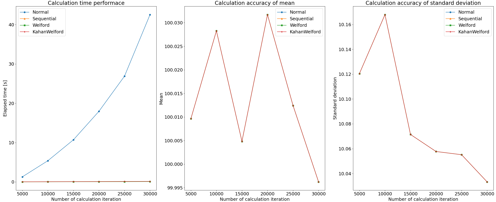
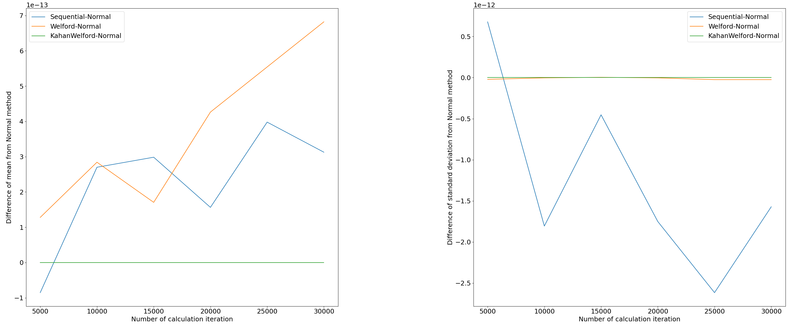

+++
title = 'Welfod法 | 平均値と分散のオンライン計算'
subtitle = ""
date = 2024-02-23
lastmod = 2024-07-15
draft = false
KaTex = true
author = "Tuuutti"
authorLink = ""
description = ""
license = "MIT"
images = []
tags = ["Machine Learning", "Welford法"]
categories = ["Machine Learning"]
featuredImage = ""
featuredImagePreview = ""
isCJKLanguage = true
hiddenFromHomePage = false
hiddenFromSearch = false
twemoji = false
lightgallery = true
ruby = true
fraction = true
fontawesome = true
linkToMarkdown = true
rssFullText = false
+++

<!--more-->

## 背景
業務である期間のストリームデータに対して、平均と分散を計算する方法を調査していたところ、`Welford法` というアルゴリズムを知ったので、一般的な計算方法との違いや実プログラムを用いた比較を行ってみる。使用したソースコードは以下レポジトリに置いてある。
GitHub：[tutti-hobbyist/welford](https://github.com/tutti-hobbyist/welford/blob/main/mean_st-dev_calc_comparison.py)

## 1. 一般的な不偏分散の計算式
$$S^2 = \frac{1}{n-1} \sum_{i=1}^{n} (x_i - \bar{x})^2$$

> $S^2$ : 不偏分散
> $n$ : 観測データ数
> $x_i$ : i番目の観測値
> $\bar{x}$ : 全データの平均値

しかしながら、本実装では観測データが更新される度に平均と偏差を出し直さなくてはならず、O($n$)の計算量が必要になり、$n$サンプルまでこれを繰り返すと結果的にO($n^2$)の計算量が必要であるため、**分散の逐次更新には適していない**。

#### 実装

```Python
class Normal(Base):
    def __init__(self):
        self.stored_data = np.empty([0])

    def __str__(self):
        return "Normal method"

    def calc(self, data):
        # https://qiita.com/byeron/items/f84b54201aced12fec80
        stored_data_converted_to_list = self.stored_data.tolist()
        stored_data_converted_to_list.append(data)
        self.stored_data = np.asarray(stored_data_converted_to_list)
        mean = np.mean(self.stored_data)
        if len(self.stored_data) ==1:
            st_dev = 0
        else:
            st_dev = np.sqrt(np.var(self.stored_data, ddof=1))
        return mean, st_dev
```

## 2. 逐次更新可能な不偏分散の計算式
一般的な不偏分散の計算式に関して式変形を行い、観測データ更新時の計算量を定数にできれば、全体の計算量をO($n$)に出来る。

$$ \begin{align*} S^2 &= \frac{1}{n-1} \sum_{x=1}^{n} (x_i - \bar{x})^2 \\\\ &= \frac{1}{n-1} \sum_{x=1}^{n} (x_i^2 - 2x_i \bar{x} + \bar{x}^2) \\\\ &= \frac{1}{n-1} \left( \sum_{x=1}^{n} x_i^2 - 2\bar{x} \sum_{x=1}^{n} x_i + n\bar{x}^2 \right) \\\\ &= \frac{1}{n-1} \left( \sum_{x=1}^{n} x_i^2 - 2n\bar{x}^2 + n\bar{x}^2 \right) \\\\ &= \frac{1}{n-1} \left( \sum_{x=1}^{n} x_i^2 - n\bar{x}^2 \right) \\\\ &= \frac{1}{n-1} \left( \sum_{x=1}^{n} x_i^2 - \frac{1}{n} \left( \sum_{x=1}^{n} x_i \right)^2 \right) \\\\    \end{align*}$$

以上より、観測データの総和と二乗和の計算結果を保持しておくことで、新しい観測データを受け取った際も、定数時間で更新後の分散を計算することができる。しかし、**サンプル数が増⼤したときに、この計算方法は成立しなくなる**。本来、不偏分散はデータ数に依らない⺟分散に収束するため、サンプル開始時からずっとその真値は変化しない。しかし、実計算上は、データ数の増大に伴い、総和と二乗和が増⼤するため、**桁落ち誤差が生じてしまう**。

#### 実装
```Python
class Sequential(Base):
    def __init__(self):
        self.num_data = 0
        self.sum = 0
        self.sum_of_squares = 0
    
    def __str__(self):
        return "Sequential method"

    def calc(self, data):
        self.num_data += 1
        self.sum += data
        self.sum_of_squares += data**2
        mean = self.sum / self.num_data
        if self.num_data == 1:
            st_dev = 0
        else:
            st_dev = np.sqrt((1/(self.num_data-1))*(self.sum_of_squares - self.sum**2/self.num_data))
        return mean, st_dev
```

## 3. Welford法
桁落ち誤差が生じない不偏分散の更新方法として、Welford法がある。この方法は平均と不偏分散を漸化式により計算する。

#### 平均の漸化式
$$ \begin{align*} \overline{x_{n+1}} - \overline{x_n} &= \frac{1}{n+1}\sum_{x=1}^{n+1}x_i - \frac{1}{n}\sum_{x=1}^{n}x_i\\\\    &= \frac{1}{n+1}{\left(x_{n+1} + \sum_{x=1}^{n}x_i\right)} - \frac{1}{n}{\sum_{x=1}^{n}x_i}\\\\    &= \frac{1}{n+1}{\left(x_{n+1} + \sum_{x=1}^{n}x_i - \frac{n+1}{n}\sum_{x=1}^{n}x_i\right)}\\\\    &= \frac{1}{n+1}{\left(x_{n+1} - \frac{1}{n}\sum_{x=1}^{n}x_i\right)}\\\\    &= \frac{1}{n+1}{\left(x_{n+1} - \overline{x_n}\right)} \end{align*} $$

#### 不偏分散の漸化式
$M_n = (n − 1)S_n^2$ …(1) として、$M_n$ を漸化式で計算する。

$$ \begin{align*} M_{n+1} - M_n &= nS_{n+1}^2 - (n-1)S_n^2 \\\\    &= \frac{n}{n} \sum_{x=1}^{n+1} (x_i - \overline{x_{n+1}})^2 - \frac{n-1}{n-1} \sum_{x=1}^{n} (x_i - \overline{x_n})^2 \\\\    &= \sum_{x=1}^{n+1} \left(x_i^2 - 2x_i \overline{x_{n+1}} + \overline{x_{n+1}}^2\right) - \sum_{x=1}^{n} \left(x_i^2 - 2x_i \overline{x_n} + \overline{x_n}^2\right)\\\\    &= \sum_{x=1}^{n+1} x_i^2 - 2 \overline{x_{n+1}} \sum_{x=1}^{n+1} x_i + (n+1) \overline{x_{n+1}}^2 - \sum_{x=1}^{n} x_i^2 + 2 \overline{x_n} \sum_{x=1}^{n} x_i - n \overline{x_n}^2\\\\    &= x_{n+1}^2 - 2 \overline{x_{n+1}} \sum_{x=1}^{n+1} x_i + (n+1) \overline{x_{n+1}}^2 + 2 \overline{x_n} \sum_{x=1}^{n} x_i - n \overline{x_n}^2 \\\\    &= x^2_{n+1} - 2\overline{x_{n+1}}(n + 1)\overline{x_{n+1}} + (n + 1)\overline{x_{n+1}}^2 + 2\overline{x_{n}}n\overline{x_{n}} - n\overline{x_{n}}^2 \\\\    &= x^2_{n+1} - 2(n + 1)\overline{x_{n+1}}^2 + (n + 1)\overline{x_{n+1}}^2 + 2n\overline{x_n}^2 - n\overline{x_n}^2 \\\\    &= x^2_{n+1} - (n + 1)\overline{x_{n+1}}^2 + n\overline{x_n}^2 \\\\    &= x^2_{n+1} - (n + 1)(\overline{x_{n+1}}^2 - \overline{x_n}^2) - \overline{x_n}^2 \\\\    &= x^2_{n+1} - (n + 1)(\overline{x_{n+1}} + \overline{x_n})(\overline{x_{n+1}} - \overline{x_n}) - \overline{x_n}^2 \\\\    &= x^2_{n+1} - (n + 1)(\overline{x_{n+1}} + \overline{x_n})\frac{1}{n+1}(x_{n+1} - \overline{x_n}) - \overline{x_n}^2 \\\\    &= x_{n+1}^2 - \left(\overline{x_{n+1}} + \overline{x_n}\right) \left(x_{n+1} - \overline{x_n}\right) - \overline{x_n}^2 \\\\    &=  \left(x_{n+1} - \overline{x_{n+1}}\right) \left(x_{n+1} - \overline{x_n}\right) \end{align*} $$

$\overline{x_{n+1}}$ と $\overline{x_n}$ は平均の漸化式から求まるため、$M_n$の漸化式を得たことになる。(1)式より不偏分散は $M_n$ を $n-1$ で割れば良いので、これで不偏分散の逐次更新ができるようになった。⼤抵の場合は $x_{n+1}$ , $\overline{x_{n+1}}$ , $\overline{x_{n}}$ は同程度の数値なので、桁落ち誤差が発⽣しなくなり、高い計算精度が期待できる。実際に単純な変形をした2の⽅法よりも精度が良い。

#### 実装
```Python
class Welford(Base):
    def __init__(self):
        self.num_data = 0
        self.mean = 0
        self.Mn = 0
    
    def __str__(self):
        return "Welford method"

    def calc(self, data):
        self.num_data += 1
        # update mean
        mean_before = self.mean
        self.mean = self.mean + (data - mean_before)/self.num_data
        # update st_dev
        right_term = (data - self.mean)*(data - mean_before)
        self.Mn = (self.Mn + right_term)
        if self.num_data == 1:
            st_dev = 0
        else:
            st_dev = np.sqrt(self.Mn/(self.num_data-1))
        return self.mean, st_dev
```

## 4. Welford法 + Kahanの加算アルゴリズム
3のWelford法の平均と分散の加算時に、[Kahanの加算アルゴリズム](https://en.wikipedia.org/wiki/Kahan_summation_algorithm)を用いることで、さらに計算精度を向上することが出来る。

#### 実装
```Python
# https://en.wikipedia.org/wiki/Kahan_summation_algorithm
class Kahan():
    def __init__(self):
        self.correct_sum_value = 0
        self.c = 0

    def add(self, data):
        y = data - self.c
        t = self.correct_sum_value + y
        self.c = (t - self.correct_sum_value) - y
        self.correct_sum_value = t
        return self

class KahanWelford(Base):
    def __init__(self):
        self.num_data = 0
        self.mean = Kahan()
        self.Mn = Kahan()

    def __str__(self):
        return "Welford method with Kahan summation"

    def calc(self, data):
        self.num_data += 1
        # update mean
        mean_before = self.mean.correct_sum_value
        self.mean = self.mean.add((data - mean_before)/self.num_data)
        # update st_dev
        right_term = (data - self.mean.correct_sum_value)*(data - mean_before)
        self.Mn = self.Mn.add(right_term)
        if self.num_data == 1:
            st_dev = 0
        else:
            st_dev = np.sqrt(self.Mn.correct_sum_value/(self.num_data-1))
        return self.mean.correct_sum_value, st_dev
```

## 上記4手法の計算時間と計算精度の比較
#### 検証方法
平均100、標準偏差10の正規分布から30,000点のデータを抽出し、それらをストリームデータとみなして、先頭から1点ずつ平均と分散を更新し行った際のパフォーマンスを確認する。計算精度の比較については、1の全データを使って一括で平均と分散を計算する方法の結果を正解として、そこからのズレを比較することで検証する。なお、凡例はそれぞれ、方法１：Normal、方法２：Sequential、方法３：Welford、方法４：KahanWelfordと記載した。

#### 計算時間および計算結果
下図の左から、計算時間、平均、標準偏差のプロットである。図より方法1の一括更新 (Normal) のみ、極端に時間を要していることがわかり、その増大具合もO($n^2$)に従っている。一方、平均と標準偏差については、値の大きさに対して計算誤差が小さいため、全く差が無いように見える。ここについては、次の計算精度のセクションで詳細に確認する。

  

#### 計算精度
下図の左から、方法１の結果に対する平均の差分、方法１の結果に対する標準偏差の差分のプロットである。平均については、方法２ (Sequential) と方法３ (Welford)では、そこまで計算精度に差がないという結果になった。一方、標準偏差については、方法３の方が方法２に比べ計算精度が高い。この結果については、方法２で述べた通り、二乗和と総和の二乗を用いて計算する方法２の方が桁落ち誤差が発生しやすいということから納得できる。また方法４では平均、標準偏差ともに、方法２、方法３よりも高い計算精度を示す結果になった。



## 参考情報
- [平均値と分散の逐次計算(オンラインアルゴリズム)](https://qiita.com/cartooh/items/2e4c9a9c4727d47d3937)
- [分散や標準偏差のオンライン計算 → Welfordアルゴリズム](https://blog.data-hacker.net/2020/11/welford.html)
- [Algorithms for calculating variance](https://en.wikipedia.org/wiki/Algorithms_for_calculating_variance)
- [Comparing three methods of computing standard deviation](https://www.johndcook.com/blog/2008/09/26/comparing-three-methods-of-computing-standard-deviation/)