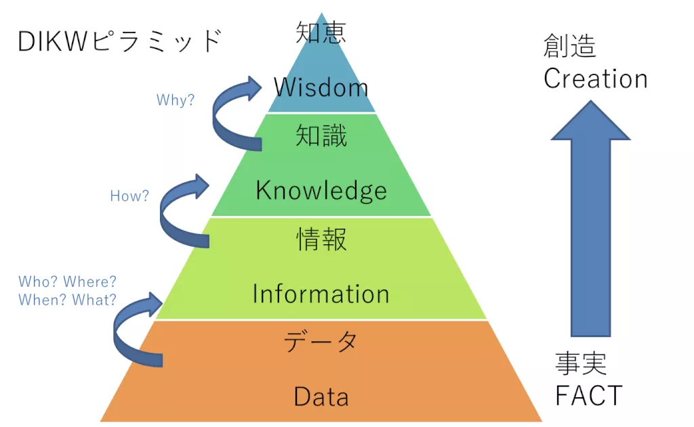
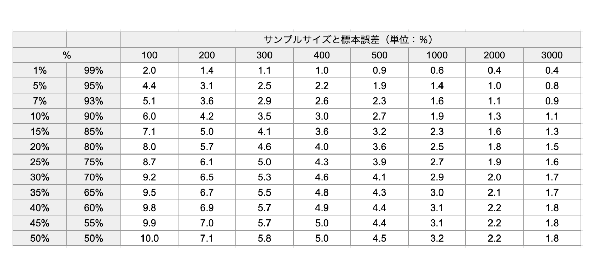

+++
title = '【読書記録】マーケティングリサーチとデータ分析の基本'
subtitle = ""
date = 2024-05-04
lastmod = 2024-05-04
draft = false
KaTex = false
author = "Tuuutti"
authorLink = ""
description = ""
license = "MIT"
images = []
tags = ["Marketing"]
categories = ["Marketing"]
featuredImage = ""
featuredImagePreview = ""
isCJKLanguage = true
hiddenFromHomePage = false
hiddenFromSearch = false
twemoji = false
lightgallery = true
ruby = true
fraction = true
fontawesome = true
linkToMarkdown = true
rssFullText = false
+++

<!--more-->

# 書籍関連リンク
- [マーケティングリサーチとデータ分析の基本](https://www.subarusya.jp/book/b353378.html)

# まとめ
## データ分析に必要なスキル
1. 情報収集力
1. 情報分析力
1. 情報解釈力
1. 情報活用力
⇒ DIKWピラミッドのイメージ

### 仮説思考の重要性
仮説を持つことで、以下のような利点がある
- リサーチ範囲や調査項目を具体的に検討できるようになる
⇒ 調査に要する時間や費用を削減可能
- 目的を見据えた分析が出来るようになる
⇒ データ分析の結果を施策に落とし込みやすい

仮説は大別すると、2つに分類される
- 現状仮説：現状に対する仮説
- 戦略仮説：有効だと推測されている施策に対する仮説

## リサーチのステップ
1. リサーチ順序の決定
    - 課題解決のインパクトが大きいものから着手
1. 目的の設定
    - リサーチ範囲のすり合わせ
1. 調査企画の設計
    - 3C分析：Customer・Competitor・Companyの立場から、市場の機会と脅威を洗い出す
    - SWOT分析：内部要因であるStrength・Weakness、外部要因であるOpportunity・Threatという4つの視点から事業環境を分析
    - STP分析：Segmentation（市場の細分化）・Targeting（ターゲットの設定）・Positioning（競合との差別化）という観点での分析
    - マーケティングミックス（4P/4C）：企業視点の4P（Product・Price・Place・Promotion）、顧客視点の4C（Customer Value・Cost・Convenience・Communication）という双方の視点をもとに分析
1. データ収集
    - 6W1Hに注意してデータの確認と収集を行う
        - What：何のデータ
        - When：いつのデータ
        - Where：どこで記録されたデータ
        - Who：誰が収集したデータ
        - Whom：誰を対象にしたデータ
        - Why：データが収集されている理由
        - How：どのようにデータが収集されたか
1. 分析と解釈
    - 分析目的と比較軸を常に意識しながら分析と解釈を行う
    - 説明力の高いデータを活用する
1. 分析結果のまとめ
    - キーメッセージを持つ
    - 誰に、何を、どのように伝えるかを考える
1. アクション

## 調査企画時に考えること
1. 背景
1. 目的
1. 対象者
1. 対象地域
1. 回答者数（サンプルサイズ）
1. 調査手法
1. 調査項目
1. 調査時期
1. 費用

### 対象者の条件を考える視点
1. 属性
1. 行動履歴
1. 必要なサンプルサイズを確保出来るか
1. 分析後に施策として落とし込める条件か

### 必要なサンプルサイズの見積もり
以下の標本誤差早見表をもとに見積もる

### 調査項目の検討方法
- 調査目的から逆算した調査項目の設定
- 仮説を立証するために必要な項目の設定
- 消費者行動モデルを参考に調査項目を検討
    1. 購買行動の基本理念！マス広告中心時代の購買行動モデル
        - AIDA（アイダ）
        - AIDMA（アイドマ）
        - AIDCAS（アイドカス）
    1. インターネット時代における購買行動モデル
        - AISAS（アイサス）
        - AISCEAS（アイシーズ）
        - ZMOT（ズィーモット）
        - FMOT（エフモット）
        - SMOT（エスモット）
        - マイクロモーメント
    1. SNSが発達・普及したことによる購買行動モデル
        - VISAS（ヴィサス）
        - SIPS（シップス）
        - ULSSAS（ウルサス）
    1. コンテンツマーケティング時代の購買行動モデル
        - DECAX（デキャックス）

