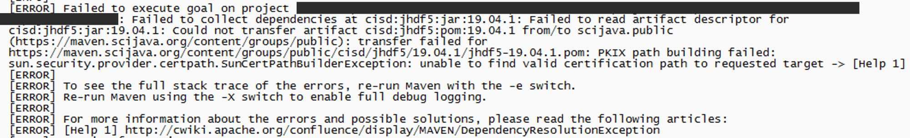
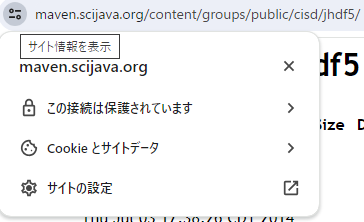
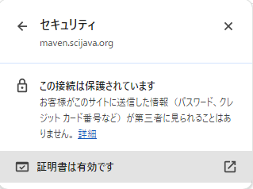
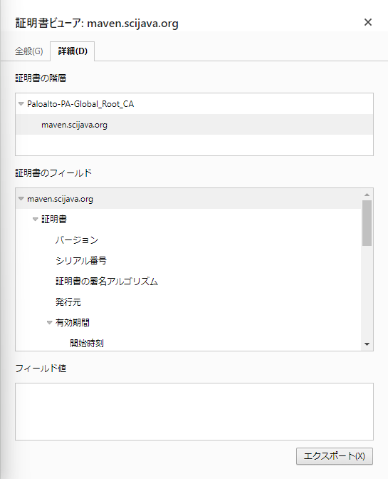

+++
title = 'Mavenレポジトリからのダウンロード時に使用するSSL証明書の追加手順'
subtitle = ""
date = 2024-01-28
lastmod = 2024-01-28
draft = true
author = "Tuuutti"
authorLink = ""
description = ""
license = "MIT"
images = []
tags = ["Maven"]
categories = ["Maven"]
featuredImage = ""
featuredImagePreview = ""
isCJKLanguage = true
hiddenFromHomePage = false
hiddenFromSearch = false
twemoji = false
lightgallery = true
ruby = true
fraction = true
fontawesome = true
linkToMarkdown = true
rssFullText = false
+++

<!--more-->

### 問題
Maven経由で以下のリポジトリから jhdf5 をダウンロードしようとすると、ビルドエラーが発生する
- リポジトリ：https://maven.scijava.org/content/groups/public/cisd/jhdf5/
- エラーログ：

### 原因
- [ ] ファイアウォール：ブラウザで接続できることを確認した
- [x] SSL証明書：今回はこの部分が原因だった

### 解決手順
#### 1. ダウンロードが失敗するリポジトリで証明書を発行
1. ブラウザで該当リポジトリを開く
2. 下図のように、`サイト情報を表示`ボタンをクリック
    
3. `この接続は保護されています`をクリックすると以下画面に遷移するので、`証明書は有効です`という文言の右側にあるボタン（証明書を表示するボタン）をクリック
    
4. 下図の画面がポップアップウィンドウとして表示されるので、詳細タブから証明書をエクスポート（証明書の拡張子は任意の形式でOK）
    

#### 2. JREに同梱されている証明書ストア cacerts にクライアント証明書を発行した認証局の証明書をインポート
> - 自分の環境では "C:\Program Files\zulu-8\jre\lib\security" 配下に cacerts が存在するが、コマンド実行時は各自の環境に対応するように読み替えて実行
1. 1.4でエクスポートした証明書の拡張子込みの絶対パス `{cert_file_path}` を確認
2. 以下コマンドを実行
    ※ ファイルパスに半角スペースを含む場合、ファイルパスを""で括る
    `keytool -import -alias {example} -keystore "C:\Program Files\zulu-8\jre\lib\security\cacerts" -file {cert_file_path}`
3. パスワードの入力を求められるので、`changeit` と入力
4. インポートを実施するか確認されるので、`Y` と入力
5. 以下コマンドを実行し、証明書が登録されたことを確認
    `keytool -list -alias {example} -keystore "C:\Program Files\zulu-8\jre\lib\security\cacerts"`

### 参考情報
- [素の OpenJDK 8 だと maven のリポジトリからダウンロードに失敗するので対処した件](https://qiita.com/yasumichi/items/de7cfd4b9fe64cbe4045)
- [SSLクライアント証明書を使って通信する](https://qiita.com/kompiro/items/25b2e01c2e9aaab7f67d)
- [Java環境に手動でグローバルサインのルート証明書をインストールする方法](https://jp.globalsign.com/support/ssl/confinfo/rootcert-import-java.html)
